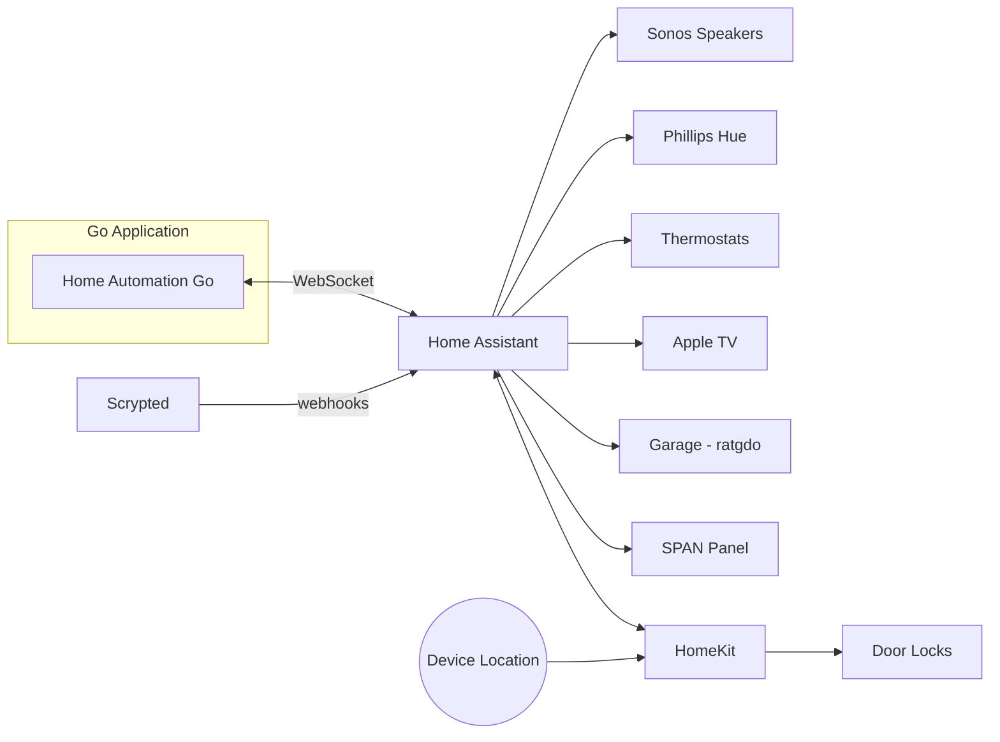

# Home Automation System

A Go-based home automation system that orchestrates smart home devices through [Home Assistant](https://www.home-assistant.io/).

## Architecture



The Go application connects to Home Assistant via WebSocket and orchestrates automations through a plugin-based architecture. All device control flows through Home Assistant's integrations.

## Plugins

The system is organized into plugins, each handling a specific automation domain:

| Plugin | Description |
|--------|-------------|
| **Day Phase** | Calculates sun events and determines current phase (morning, day, evening, winddown, sleep) |
| **State Tracking** | Derives presence and sleep state from sensors and device trackers |
| **Lighting** | Activates Phillips Hue scenes based on day phase, presence, and sleep status |
| **Music** | Controls Sonos playback based on time of day, occupancy, and special modes |
| **TV** | Monitors Apple TV playback to coordinate with music and lighting |
| **Energy** | Monitors battery levels, solar generation, and grid status via SPAN panel |
| **Load Shedding** | Adjusts thermostat setpoints based on energy availability |
| **Sleep Hygiene** | Manages wake-up sequences, bedtime reminders, and sleep music fade-out |
| **Security** | Handles door locks, garage automation, and arrival notifications |
| **Christmas** | Seasonal holiday automations |
| **Reset** | Coordinates system-wide state resets |

## Configuration

Automation behavior is configured via YAML files in [`configs/`](configs/):

- [`hue_config.yaml`](configs/hue_config.yaml) - Lighting scenes per room with conditional logic
- [`music_config.yaml`](configs/music_config.yaml) - Music playback modes and speaker groupings
- [`schedule_config.yaml`](configs/schedule_config.yaml) - Time-based schedules
- [`energy_config.yaml`](configs/energy_config.yaml) - Energy level thresholds and load shedding rules

## Running

### Prerequisites

- Go 1.23+
- Home Assistant with WebSocket API enabled
- Long-lived access token from Home Assistant

### Quick Start

```bash
cd homeautomation-go
cp .env.example .env
# Edit .env with your Home Assistant URL and token
go run cmd/main.go
```

### Docker

```bash
# Build and run
make docker-build-go
make docker-run-go

# Or pull from GHCR
docker pull ghcr.io/nickborgersonlowsecuritynode/home-automation:latest
```

See [homeautomation-go/README.md](homeautomation-go/README.md) for detailed setup instructions.

## Dashboard & Monitoring

- **Dashboard**: View current state at `/dashboard` (port 8080)
- **API**: Query state via `/api/state`, `/api/shadow/{plugin}`
- **Logs**: Centralized in [Gravwell](https://gravwell.featherback-mermaid.ts.net/) with tags `home-automation` and `home-assistant`

## Development

See [AGENTS.md](AGENTS.md) for the complete development guide including:

- Test commands (`make unit-tests`, `make integration-tests`)
- Code standards and patterns
- Shadow state implementation requirements
- Documentation maintenance

For architecture details, see [docs/](docs/):
- [Architecture Overview](docs/architecture/ARCHITECTURE.md)
- [Visual Diagrams](docs/human/VISUAL_ARCHITECTURE.md)
- [Plugin System](docs/reference/PLUGIN_SYSTEM.md)
- [Automation Flows](docs/flows/)

## Contributing

All pull requests require passing tests before merge:

- Go unit tests with race detector
- Integration tests
- Config validation (YAML + Spotify URIs)
- Coverage check (≥65%)

See [docs/operations/BRANCH_PROTECTION.md](docs/operations/BRANCH_PROTECTION.md) for details.

## Legacy Reference

The original Node-RED implementation is preserved in [`docs/archive/flows.json`](docs/archive/flows.json) for historical reference.
