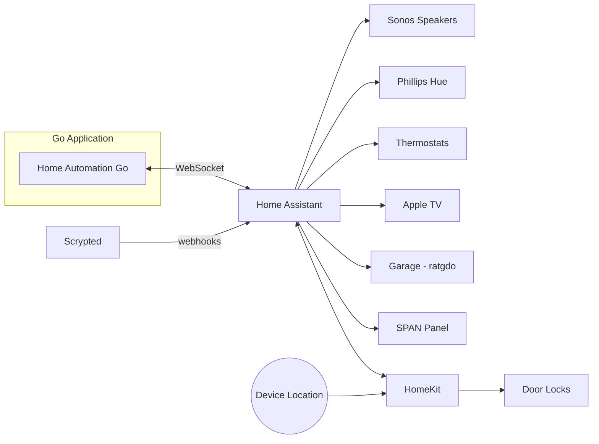

# Home Automation System

A Go-based home automation system that orchestrates smart home devices through [Home Assistant](https://www.home-assistant.io/).

## Architecture



The Go application connects to Home Assistant via WebSocket and orchestrates automations through a plugin-based architecture. All device control flows through Home Assistant's integrations.

## Plugins

The system is organized into plugins, each handling a specific automation domain:

| Plugin | Description |
|--------|-------------|
| **Day Phase** | Calculates sun events and determines current phase (morning, day, evening, winddown, sleep) |
| **State Tracking** | Derives presence and sleep state from sensors and device trackers |
| **Lighting** | Activates Phillips Hue scenes based on day phase, presence, and sleep status |
| **Music** | Controls Sonos playback based on time of day, occupancy, and special modes |
| **TV** | Monitors Apple TV playback to coordinate with music and lighting |
| **Energy** | Monitors battery levels, solar generation, and grid status via SPAN panel |
| **Load Shedding** | Adjusts thermostat setpoints based on energy availability |
| **Sleep Hygiene** | Manages wake-up sequences, bedtime reminders, and sleep music fade-out |
| **Security** | Handles door locks, garage automation, and arrival notifications |
| **Christmas** | Seasonal holiday automations |
| **Reset** | Coordinates system-wide state resets |

## Configuration

Automation behavior is configured via YAML files in [`configs/`](configs/):

- [`hue_config.yaml`](configs/hue_config.yaml) - Lighting scenes per room with conditional logic
- [`music_config.yaml`](configs/music_config.yaml) - Music playback modes and speaker groupings
- [`schedule_config.yaml`](configs/schedule_config.yaml) - Time-based schedules
- [`energy_config.yaml`](configs/energy_config.yaml) - Energy level thresholds and load shedding rules

## Running

### Devcontainer (Recommended)

**The devcontainer is the strongly recommended way to work with this repository.** It provides a pre-configured development environment with all dependencies, tools, and git hooks already installed. This is also the same environment used by CI pipelines.

**Using VS Code or GitHub Codespaces:**
1. Open the repository in VS Code
2. When prompted, click "Reopen in Container" (or use the Command Palette: `Dev Containers: Reopen in Container`)
3. Wait for the container to build and initialize

The devcontainer automatically:
- Installs Go 1.25 and all required dependencies
- Sets up Go modules (`go mod tidy && go mod download`)
- Installs git hooks (pre-commit and pre-push validation)
- Installs GitHub CLI, Claude Code CLI, and Playwright (with Chromium)
- Configures VS Code extensions for Go and Mermaid
- Imports your host GitHub CLI token and Claude Code credentials into the container so long as you are logged in locally before opening the devcontainer (you will see warnings during startup if host credentials are missing)

### Manual Setup (Without Devcontainer)

If you cannot use a devcontainer, you can set up the environment manually by running the same scripts the devcontainer uses:

**Prerequisites:**
- Go 1.24
- Node.js 20+ (required for Playwright tooling)
- Home Assistant with WebSocket API enabled
- Long-lived access token from Home Assistant

**Setup steps:**
```bash
# 1. Install Go modules
cd homeautomation-go
go mod tidy && go mod download
cd ..

# 2. Install git hooks (IMPORTANT: ensures code quality)
bash .githooks/install-hooks.sh

# 3. (Optional) Install Claude Code CLI
curl -fsSL https://claude.ai/install.sh | bash

# 4. (Optional) For Playwright/screenshot testing, see AGENTS.md "Testing UI Changes" section
```

### Quick Start

```bash
cd homeautomation-go
cp .env.example .env
# Edit .env with your Home Assistant URL and token
go run cmd/main.go
```

### Docker

```bash
# Build and run
make docker-build-go
make docker-run-go

# Or pull from GHCR
docker pull ghcr.io/nickborgersonlowsecuritynode/home-automation:latest
```

See [homeautomation-go/README.md](homeautomation-go/README.md) for detailed setup instructions.

## Dashboard & Monitoring

- **Dashboard**: View current state at `/dashboard` (port 8080)
- **API**: Query state via `/api/state`, `/api/shadow/{plugin}`
- **Logs**: Centralized in [Gravwell](https://gravwell.featherback-mermaid.ts.net/) with tags `home-automation` and `home-assistant`

## Development

See [AGENTS.md](AGENTS.md) for the complete development guide including:

- Test commands (`make unit-tests`, `make integration-tests`)
- Code standards and patterns
- Shadow state implementation requirements
- Documentation maintenance

For architecture details, see [docs/](docs/):
- [Architecture Overview](docs/architecture/ARCHITECTURE.md)
- [Visual Diagrams](docs/human/VISUAL_ARCHITECTURE.md)
- [Plugin System](docs/reference/PLUGIN_SYSTEM.md)
- [Automation Flows](docs/flows/)

## Contributing

All pull requests go through a two-phase review process before merge:

### 1. Automated Tests (PR Tests)
- Go unit tests with race detector
- Integration tests
- Config validation (YAML + Spotify URIs)
- Coverage check (≥65%)
- Docker build validation

### 2. AI-Powered Code Review (AI Code Review)
After tests pass, a multi-agent AI review pipeline automatically runs:

| Agent | Focus |
|-------|-------|
| Design Review | Validates PR implements issue intent, critiques design decisions |
| Code Review | Code quality, patterns, error handling |
| Test Review | Missing tests, test quality |
| Concurrency Review | Race conditions, mutex usage, goroutine leaks |
| Docs Review | Documentation updates needed for code changes |
| Merge Decision | Final go/no-go based on all reviews |

**Important notes:**
- AI reviewers may push commits directly to your PR branch (fixes, doc updates)
- If tests fail, the AI assistant will attempt to fix them (up to 3 times) and push fixes to your branch
- Reviews are skipped for PRs from forks (security measure) - maintainers will review manually
- To re-run reviews after they pass, close and reopen the PR

See [docs/operations/AI_GHA_PIPELINES.md](docs/operations/AI_GHA_PIPELINES.md) for the full workflow details and [docs/operations/BRANCH_PROTECTION.md](docs/operations/BRANCH_PROTECTION.md) for branch protection rules.

## Legacy Reference

The original Node-RED implementation is preserved in [`docs/archive/flows.json`](docs/archive/flows.json) for historical reference.
