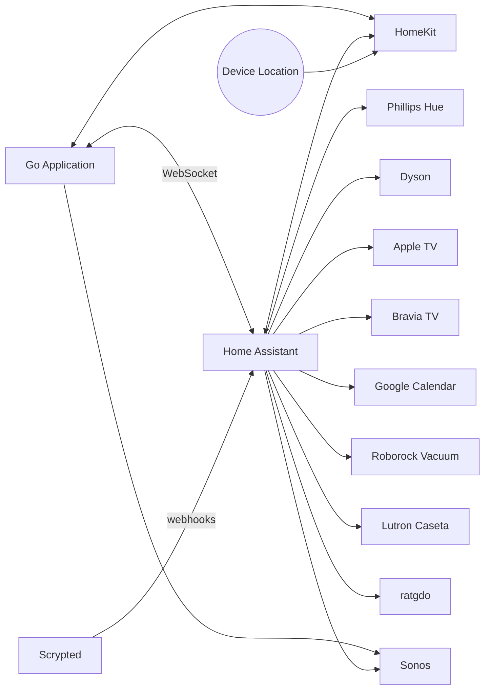

Home Automation
========

## Intro

### About

This repository contains my home automation system built in Go, using a WebSocket connection to [Home Assistant](https://www.home-assistant.io/) which interfaces with various devices.

These are public in case they are interesting or even useful to someone else, so that I can ask help from other home automation enthusiasts, and show off a bit.

### Components


### Running Locally

See [homeautomation-go/README.md](./homeautomation-go/README.md) for detailed instructions on building and running the application.

Quick start:
```bash
cd homeautomation-go
cp .env.example .env
# Edit .env with your Home Assistant URL and token
go build -o homeautomation ./cmd/main.go
./homeautomation
```

For development with mock Home Assistant data:
```bash
make dev-ui
# Dashboard available at http://localhost:8080/dashboard
```

## Automation Modules

### Music - Sonos
Sonos speakers play audio ambiently at basically all times. Different playback behavior is defined in [music_config.yaml](configs/music_config.yaml) and activated by the music plugin.

Music config remains quite complex. Playlists can be tried out directly through the Sonos app or Spotify, then get added to the configuration file.

### Lighting Control
A blend of Lutron Caseta and Phillips Hue lights are used to provide accent and ambient lighting in the home. Task lighting is entirely separate and uses manually switched lights. Conditional behavior is driven by [hue_config.yaml](configs/hue_config.yaml) but a scene in the Hue system must exist for activation based on the "day phase" of the home.

Modifying the lighting of a scene is done directly through the Hue App - you save the Scene with the name matching which "Home Day Phase" it is for, e.g. `Morning`.


### Configuration Files
The fairly complex configuration objects describing intents for music playback and lighting are tracked as YAML files:
  - [hue_config.yaml](configs/hue_config.yaml)
  - [music_config.yaml](configs/music_config.yaml)
  - [schedule_config.yaml](configs/schedule_config.yaml)
  - [energy_config.yaml](configs/energy_config.yaml)

[The config files are validated for YAML correctness using `yamllint` in a GitHub Action](.github/workflows/pr-tests.yml). Because the majority of music playback leverages public Spotify playlists, the [music_config.yaml](configs/music_config.yaml) gets additional validation by a [script which confirms every indicated Spotify Playback URI is a valid, reachable, and public Spotify Playlist](config-test/validate_spotify_uris.py).

### State Tracking
Responding to the occupants of the home requires tracking state, largely facilitated with HomeKit presence tracking and door sensors. The behavior of the home varies depending on whether or not a guest is present, manifesting as a manually-switched configuration controlled via HomeKit.

### Sleep Hygiene
Sleep hygiene automations help with bedtime routines and morning wake-ups.

### TV Monitoring and Manipulation
When watching something on the TV, nearby speakers mute. The system monitors the TV and associated Apple TV to drive these automations.

### Energy State
An electrical energy generation, storage, and backup system is summarized through a "level" concept configured in:
  - [energy_config.yaml](configs/energy_config.yaml)

Free nighttime energy can override the energy level when infinite free electricity is available.

### Load Shedding
To better utilize backup energy supply, load shedding goes beyond what [SPAN panels provide](https://www.span.io/panel). HVAC is the largest energy use, so widening temperature ranges can save significant energy. If certain energy levels are reached, temperature ranges widen to save energy or resume "comfort" mode.

### Security
Based on Apple HomeKit presence detection and/or everyone going to sleep, the house locks down. The garage door can open automatically if someone is returning and it's closed (thanks [ratgdo](https://ratcloud.llc/)).

This also includes doorbell notifications from Scrypted and a trigger activated via Siri ("Turn on expecting someone") to cause a notification when a vehicle arrives.

## Contributing

### Pull Request Requirements

**All pull requests require passing tests before merge.** This repository uses automated CI/CD testing to ensure code quality.

When you submit a PR:
- GitHub Actions automatically runs tests
- Go unit tests (with race detector)
- Integration tests
- Config validation (YAML files)
- Coverage check (≥70%)

**The PR merge button is blocked until all required tests pass.**

For detailed information:
- **[docs/operations/BRANCH_PROTECTION.md](./docs/operations/BRANCH_PROTECTION.md)** - Complete guide to PR requirements and branch protection
- **[AGENTS.md](./AGENTS.md)** - Development standards and testing guide
- **[homeautomation-go/README.md](./homeautomation-go/README.md)** - Go implementation documentation
