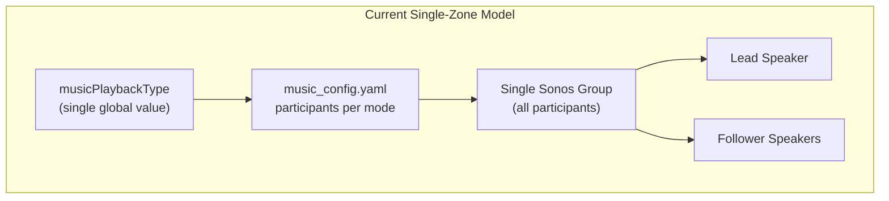
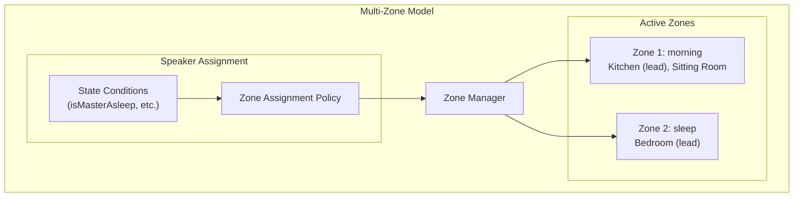
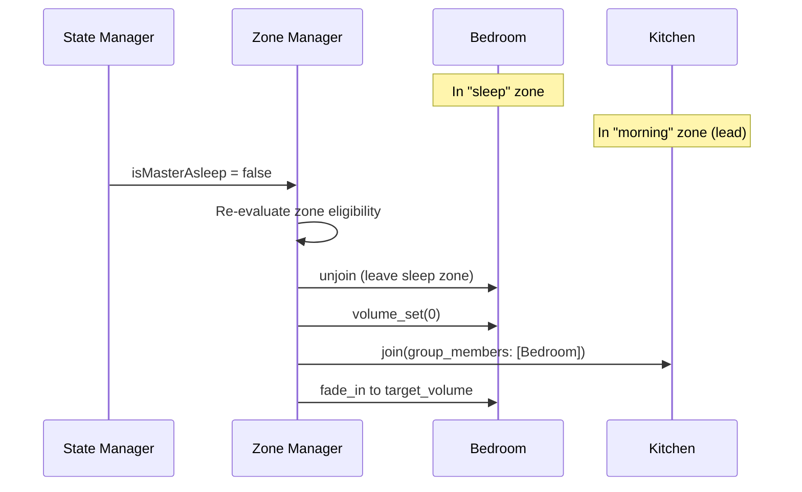

# Multi-Zone Music Playback Design

This document describes the phased implementation plan for enabling multiple simultaneous music playback zones with Sonos speakers.

## Problem Statement

Today the music system plays exactly one "zone" of music at a time. All speakers participating in a music type (e.g., "morning", "sleep") form a single Sonos group controlled by one lead speaker.

**Desired behavior:**
- Multiple zones can play different music types simultaneously (e.g., "sleep" in Bedroom while "morning" in Kitchen)
- Speakers can dynamically move between zones based on state changes (e.g., when `isMasterAsleep` becomes false, Bedroom joins the "morning" zone)
- Volume reset and fade-in when a speaker joins a new zone

## Current Architecture



### Current Limitations

1. **Global music type**: One `musicPlaybackType` state variable controls all speakers
2. **Monolithic groups**: All mode participants form one Sonos group
3. **Binary speaker control**: Speakers are either muted or unmuted, but always in the same group
4. **Mute conditions are reactive only**: `leave_muted_if` controls muting within the active zone but can't move speakers between zones

## Proposed Architecture



### Key Concepts

1. **Zone**: A Sonos group playing a specific music type with its own lead speaker
2. **Zone Assignment Policy**: Rules determining which zone a speaker belongs to (replaces `leave_muted_if`)
3. **Zone Manager**: Coordinates multiple concurrent zones, handles speaker migration

## Phased Implementation Plan

### Phase 1: Zone Assignment Policy Framework

**Goal**: Refactor configuration to define which zone a speaker belongs to, rather than just mute conditions.

**Config Changes:**

```yaml
# Current (implicit single zone)
music:
  morning:
    participants:
      - player_name: "Kitchen"
        base_volume: 9
        leave_muted_if:
          - variable: isTVPlaying
            value: true
      - player_name: "Bedroom"
        base_volume: 9
        leave_muted_if:
          - variable: isMasterAsleep
            value: true

# Phase 1 (zone eligibility)
music:
  morning:
    participants:
      - player_name: "Kitchen"
        base_volume: 9
        exclude_if:
          - variable: isTVPlaying
            value: true
      - player_name: "Bedroom"
        base_volume: 9
        exclude_if:
          - variable: isMasterAsleep
            value: true
```

**Semantic Change:**
- `leave_muted_if` -> `exclude_if`: Instead of "include but mute", speakers with matching conditions are excluded from the zone entirely
- This prepares for Phase 2 where excluded speakers can join a different zone

**Code Changes:**
1. Rename `LeaveMutedIf` to `ExcludeIf` in config structs
2. Update `shouldUnmuteSpeaker()` to `shouldIncludeInZone()`
3. Build Sonos groups with only eligible speakers (rather than grouping all and muting some)

**Backward Compatibility:**
- Behavior is identical for single-zone operation
- YAML supports both `leave_muted_if` and `exclude_if` during transition

**Testing:**
- Unit tests for zone eligibility logic
- Integration tests verifying correct group membership

### Phase 2: Multiple Active Zones

**Goal**: Enable multiple music types to play simultaneously on different speaker groups.

**State Model Changes:**

```go
// Current
type Manager struct {
    currentlyPlaying *CurrentlyPlayingMusic  // Single zone
}

// Phase 2
type Manager struct {
    activeZones map[string]*Zone  // Multiple zones keyed by music type
}

type Zone struct {
    MusicType    string
    LeadSpeaker  string
    Participants []ParticipantWithVolume
    StartedAt    time.Time
}
```

**Config Changes:**

```yaml
# Phase 2: Zone priority and defaults
music:
  zones:
    - name: "sleep"
      priority: 100  # Highest priority - takes precedence
      trigger:
        - variable: isMasterAsleep
          value: true
    - name: "morning"
      priority: 50
      trigger:
        - variable: dayPhase
          value: morning
        - variable: isAnyoneAsleep
          value: false
    - name: "day"
      priority: 10
      default: true  # Fallback when no other zone is triggered
```

**Zone Resolution Logic:**
1. Evaluate all zone triggers
2. Higher priority zones claim speakers first
3. Lower priority zones get remaining speakers
4. A speaker can only be in one zone at a time

**Code Changes:**
1. New `ZoneManager` component
2. Replace single `musicPlaybackType` with per-speaker zone assignments
3. Orchestrate multiple Sonos groups in parallel
4. Shadow state shows all active zones

### Phase 3: Dynamic Speaker Migration

**Goal**: Allow speakers to move between zones when conditions change.

**Scenario:**
1. Kitchen playing "morning" music
2. Bedroom playing "sleep" music (isMasterAsleep=true)
3. isMasterAsleep becomes false
4. Bedroom should:
   - Leave "sleep" zone
   - Join "morning" zone with Kitchen
   - Fade in at appropriate volume

**Migration Sequence:**



**Code Changes:**
1. Add `migrateSpea ker(from, to Zone)` method
2. Subscription handlers trigger zone re-evaluation
3. Track pending migrations to prevent race conditions
4. Handle edge cases (source zone becomes empty, target zone doesn't exist)

**Testing:**
- Integration tests for migration sequences
- Race condition tests with rapid state changes

### Phase 4: Advanced Features

**Goal**: Polish and optimize multi-zone behavior.

**Features:**
1. **Zone Persistence**: Remember zone assignments across restarts
2. **Graceful Degradation**: Handle unavailable speakers without affecting other zones
3. **Cross-fade**: Option to fade out of old zone while fading into new zone
4. **Zone Merging**: When zones have the same music type, consider merging them
5. **UI Dashboard**: Show active zones and speaker assignments

## Migration Path

```mermaid
flowchart LR
    subgraph Current["Current"]
        A["Single musicPlaybackType"]
        B["All speakers in one group"]
        C["leave_muted_if for control"]
    end

    subgraph Phase1["Phase 1"]
        D["exclude_if semantics"]
        E["Eligible-only groups"]
    end

    subgraph Phase2["Phase 2"]
        F["Multiple active zones"]
        G["Zone priority system"]
    end

    subgraph Phase3["Phase 3"]
        H["Dynamic speaker migration"]
        I["Smooth zone transitions"]
    end

    Current --> Phase1
    Phase1 --> Phase2
    Phase2 --> Phase3
```



## API Changes

### Shadow State (Phase 2+)

```json
{
  "outputs": {
    "activeZones": [
      {
        "musicType": "morning",
        "leadSpeaker": "Kitchen",
        "participants": ["Kitchen", "Sitting Room"],
        "startedAt": "2026-01-06T08:30:00Z"
      },
      {
        "musicType": "sleep",
        "leadSpeaker": "Bedroom",
        "participants": ["Bedroom"],
        "startedAt": "2026-01-06T07:00:00Z"
      }
    ]
  }
}
```

### Reset API (Phase 2+)

```
POST /api/plugins/music/reset
{
  "zone": "morning"  // Optional: reset specific zone, or all if omitted
}
```

## Risks and Mitigations

| Risk | Mitigation |
|------|------------|
| Sonos group operations are slow (~500ms each) | Parallelize where possible, batch operations |
| Race conditions with rapid state changes | Debounce state changes, serialize zone operations |
| Config complexity increases | Provide sensible defaults, validate config on load |
| Backward compatibility | Support old config format indefinitely |
| Testing complexity | Scenario-based integration tests for each phase |

## Open Questions

1. **Zone naming**: Should zones be named by music type, or should zones have independent names that map to music types?
2. **Empty zones**: When all speakers leave a zone, should playback stop or continue (for when speakers return)?
3. **Zone creation**: Should zones be pre-defined in config or created dynamically?
4. **Lead speaker selection**: When building a zone, how to choose the lead speaker? (Currently: first participant)

## Related Documentation

- [ARCHITECTURE.md](./ARCHITECTURE.md) - System architecture
- [DAY_PHASE_MODES.md](../flows/DAY_PHASE_MODES.md) - Day phase and music mode relationships
- [SHADOW_STATE.md](../reference/SHADOW_STATE.md) - Shadow state pattern
- [music_config.yaml](../../configs/music_config.yaml) - Current music configuration

---

**Created**: 2026-01-06
**Parent Issue**: #417
**Phase 1 Issue**: #418
**Status**: Design Complete - Ready for Phase 1 Implementation
