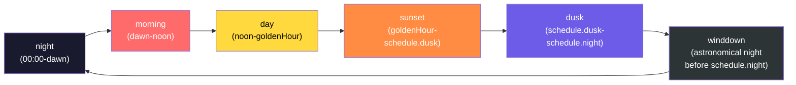
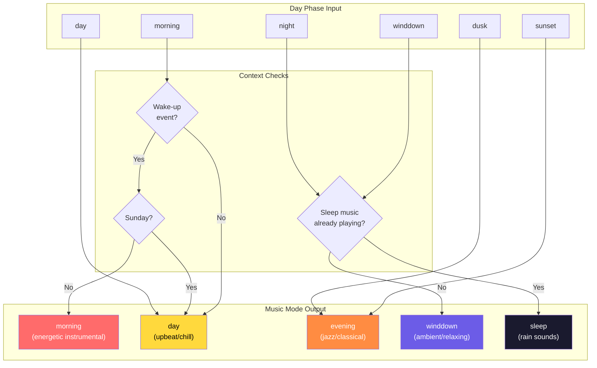
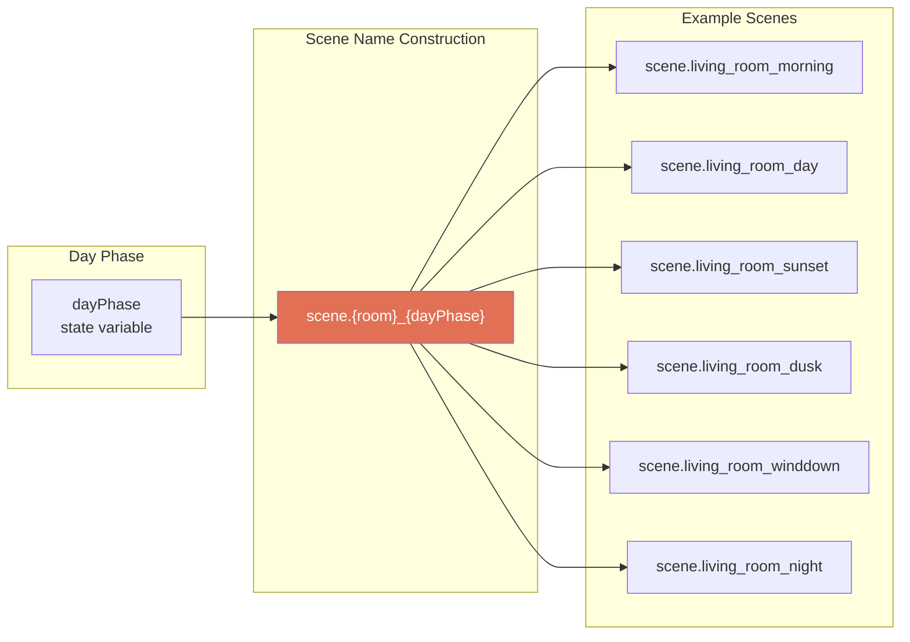
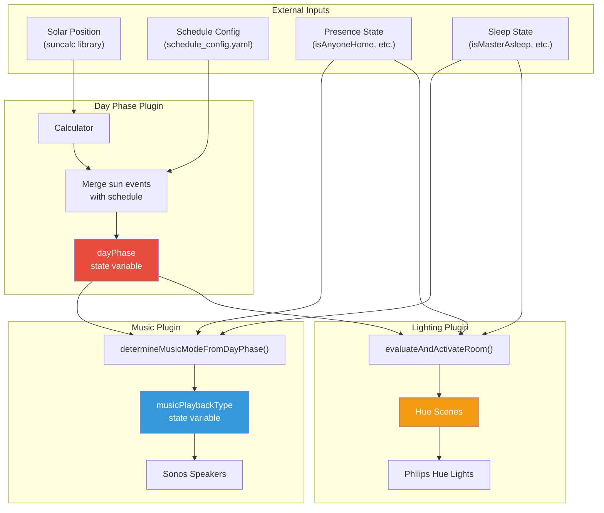
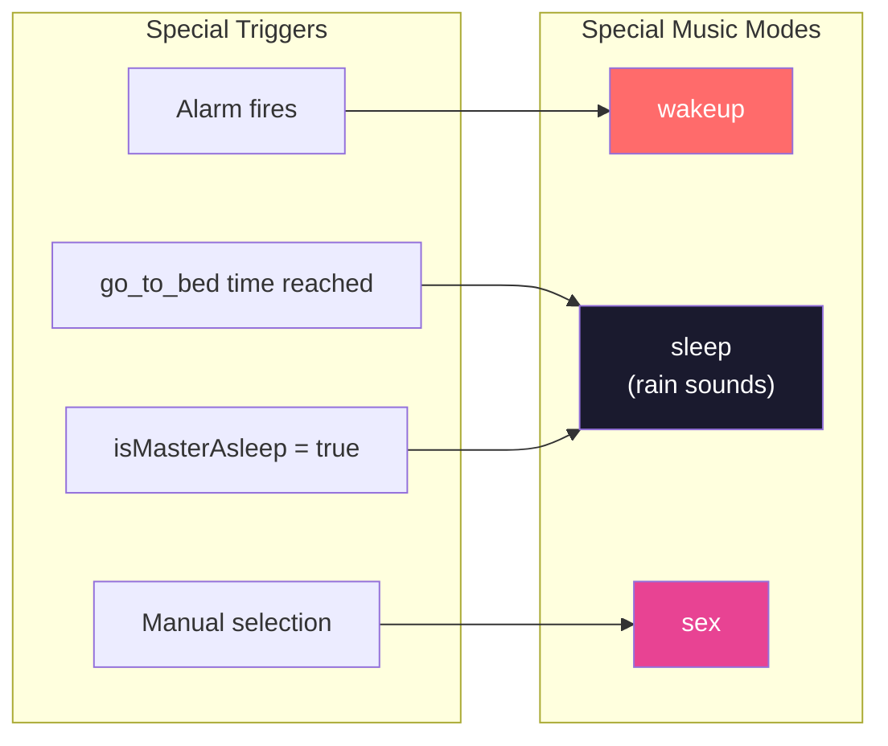

# Day Phase, Music Mode, and Lighting Scene Relationships

This document describes how the `dayPhase` state variable controls music playback and lighting scenes throughout the home automation system.

## Overview

The system uses a cascading relationship:

1. **Sun Events** (astronomical) - Calculated from solar position
2. **Day Phases** (schedule-adjusted) - Sun events modified by user schedule
3. **Music Modes** - Mapped from day phases with context
4. **Lighting Scenes** - Directly use day phase names

```mermaid
flowchart TB
    subgraph Astronomical["Astronomical Events (suncalc)"]
        dawn["dawn"]
        goldenHourEnd["goldenHourEnd"]
        goldenHour["goldenHour"]
        dusk["dusk"]
        night["night (astronomical)"]
    end

    subgraph SunEvents["Sun Events (simplified)"]
        SE_night["night"]
        SE_morning["morning"]
        SE_day["day"]
        SE_sunset["sunset"]
        SE_dusk["dusk"]
    end

    subgraph DayPhases["Day Phases (schedule-adjusted)"]
        DP_night["night"]
        DP_morning["morning"]
        DP_day["day"]
        DP_sunset["sunset"]
        DP_dusk["dusk"]
        DP_winddown["winddown"]
    end

    dawn --> SE_morning
    noon["noon (12:00)"] --> SE_day
    goldenHour --> SE_sunset
    dusk --> SE_dusk
    night --> SE_night

    SE_night --> DP_night
    SE_morning --> DP_morning
    SE_day --> DP_day
    SE_sunset --> DP_sunset
    SE_dusk --> DP_dusk
    SE_night --> DP_winddown

    style Astronomical fill:#1a1a2e
    style SunEvents fill:#16213e
    style DayPhases fill:#0f3460
```

## Day Phase Cycle

The daily cycle of phases based on astronomical events and schedule configuration:

## Day Phase to Music Mode Mapping

The music plugin maps day phases to music modes with additional context awareness:

### Music Mode Details

| Music Mode | Day Phases | Playlist Style | Notes |
|------------|------------|----------------|-------|
| `morning` | morning (wake-up only) | Instrumental melodic house/techno, epic classical | Only plays on wake-up events; skipped on Sundays |
| `day` | morning (no wake-up), day | Kygo, chill tracks, soft house, country | Default daytime music |
| `evening` | sunset, dusk | Instrumental study, jazz, classical, chilled jazz | Calmer evening music |
| `winddown` | winddown, night | Floating through space, ambient relaxation, sleep prep | Pre-sleep relaxation |
| `sleep` | (manual trigger) | Rain sounds | Triggered by sleep state, not day phase |
| `wakeup` | (alarm trigger) | Ambient relaxation | Gentle wake-up music |

## Day Phase to Lighting Scene Mapping

The lighting plugin uses day phases directly as Hue scene names:

### Lighting Scene Characteristics

| Day Phase | Typical Scene Characteristics |
|-----------|------------------------------|
| `morning` | Bright, cool white, energizing |
| `day` | Full brightness, natural daylight |
| `sunset` | Warm colors, dimming begins |
| `dusk` | Warmer, lower brightness |
| `winddown` | Very warm, low brightness |
| `night` | Minimal light, very warm tones |

## Complete System Flow

## Schedule Configuration

The schedule config (`configs/schedule_config.yaml`) defines when phase transitions occur:

| Field | Purpose | Weekday Default | Weekend Default |
|-------|---------|-----------------|-----------------|
| `dusk` | Override sunset→dusk transition | 20:00 | 20:00 |
| `winddown` | Time when winddown begins | 22:15 | 22:00 |
| `night` | Force night phase | 23:00 | 23:59 |
| `stop_screens` | Reminder to stop screen time | 22:30 | 22:30 |
| `go_to_bed` | Start sleep music (rain sounds) | 23:00 | 23:00 |
| `begin_backup_wake` | **BACKUP** start wake sequence (if Eight Sleep unavailable) | 08:50 | 09:50 |
| `backup_wake_time` | **BACKUP** target wake time (if Eight Sleep unavailable) | 09:15 | 10:15 |

> **Wake-up behavior**: The primary wake trigger is the Eight Sleep Pod alarm. The `begin_backup_wake` and `backup_wake_time` values are **fallback only** and activate only when the Eight Sleep integration is unavailable (sensor shows `"unavailable"`). This ensures reliable wake-up even during Internet outages.

## Special Music Modes

These modes are not tied to day phases:

> **Note:** The `go_to_bed` scheduled time automatically starts rain sounds by setting `musicPlaybackType` to `"sleep"`. This happens unconditionally at the configured time, regardless of presence or sleep state. The `isMasterAsleep` trigger also activates sleep music when someone is detected as asleep.

## Related Documentation

### Detailed Flow Documentation

- [MUSIC_PLAYBACK.md](./MUSIC_PLAYBACK.md) - Music playback orchestration, speaker grouping, volume fading
- [LIGHTING_CONTROL.md](./LIGHTING_CONTROL.md) - Scene management, manual overrides, wake protection
- [SLEEP_HYGIENE.md](./SLEEP_HYGIENE.md) - Wake sequence, Eight Sleep integration, bedtime triggers

### Reference

- [PLUGIN_SYSTEM.md](../reference/PLUGIN_SYSTEM.md) - Plugin architecture details
- [SHADOW_STATE.md](../reference/SHADOW_STATE.md) - Shadow state pattern for debugging
- [migration_mapping.md](../reference/migration_mapping.md) - State variable reference
- [VISUAL_ARCHITECTURE.md](../human/VISUAL_ARCHITECTURE.md) - System architecture diagrams
