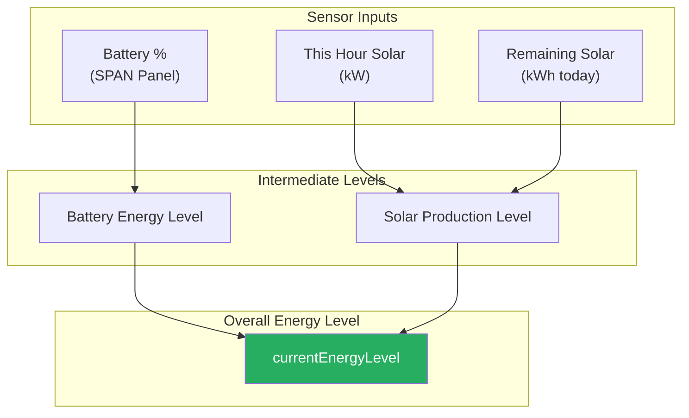
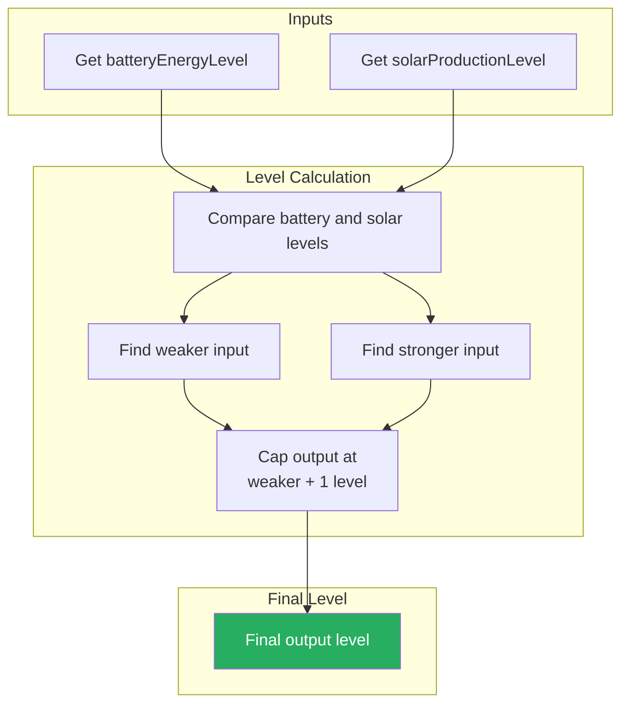
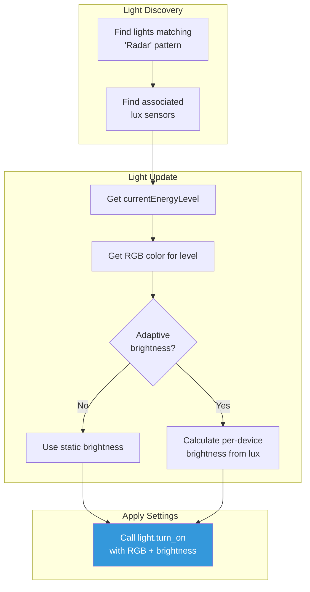
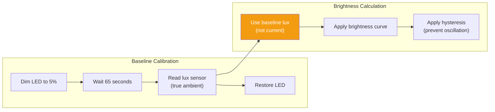
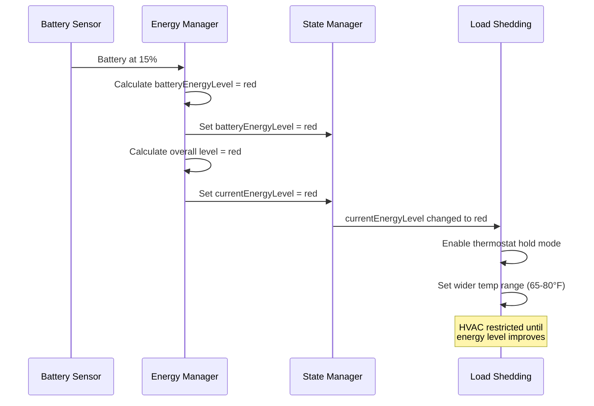

# Energy Management Flow

This document describes the energy management automation flow, which monitors battery and solar levels to optimize home energy usage and provide visual indicators.

## Overview

The energy plugin manages home energy by:
1. Monitoring battery percentage and solar production
2. Calculating overall energy availability levels
3. Displaying energy state on indicator lights throughout the home
4. Triggering load shedding when battery is low

## Energy Level Calculation

The system combines battery level and solar production to determine overall energy availability:

### Energy State Hierarchy

Energy states are ordered from lowest to highest availability:

| State | Color | Battery Min | Solar Min | Meaning |
|-------|-------|-------------|-----------|---------|
| `red` | Red | 0% | 0 kW | Critical - load shed (HVAC band + non-HVAC off) |
| `yellow` | Yellow | 15% | 0.1 kW | Hysteresis band covering normal arbitrage operation |
| `green` | Green | 60% | 1.0 kW / 5 kWh remaining | Good - energy available |
| `white` | White | 80% | 4.0 kW / 20 kWh remaining | Abundant solar / stored energy |

### Overall Level Algorithm

The overall level follows the stronger of battery and solar, but is capped at one level above the weaker input. This prevents a high battery from showing `white` when solar production is weak or absent, while still allowing strong solar to boost a lower battery level.

- Output starts as the stronger of battery and solar
- Maximum output is the weaker input + 1 level

Examples:
- Battery: white (80%+), Solar: yellow (weak production) → Result: green (not white)
- Battery: green (60%), Solar: red (0 kW) → Result: yellow (capped by weak solar)
- Battery: yellow (15-59%), Solar: green (1+ kW, 5+ kWh) → Result: green (boosted by 1)
- Battery: red (<15%), Solar: green (1+ kW, 5+ kWh) → Result: yellow (boosted by 1, not green)

## Free Energy Detection

Scheduled free metered grid energy is no longer used. The `white` energy level now comes from the configured battery and solar thresholds, so abundant solar production can still enable unrestricted-energy behavior.

## Indicator Light Updates

Energy state is displayed on RGB indicator lights (Apollo MTR-2 sensors):

### Adaptive Brightness

When enabled, indicator lights adjust brightness based on ambient light:

**Why calibration?** The lux sensor is on the same device as the LED, so the LED's light "contaminates" the reading. By periodically dimming the LED, we get a true ambient reading.

**Brightness Curve:**

| Ambient Lux | Brightness |
|-------------|------------|
| < 10 (very dark) | 20% |
| 10-100 (dim) | 40% |
| > 100 (bright) | 50% (capped) |

## Load Shedding Integration

When energy is low, the load shedding plugin restricts HVAC:

When energy is abundant (white level), the load shedding plugin activates **thermal battery** mode, gradually shifting HVAC setpoints ±2°F (in 1°F steps) to pre-condition the house and store thermal energy in the building mass. The gradual stepping avoids triggering auxiliary heat strips.

See [LOAD_SHEDDING.md](./LOAD_SHEDDING.md) for thermostat control and thermal battery details.

## State Variables

### Inputs (from Home Assistant)

| Variable | Source Entity | Description |
|----------|---------------|-------------|
| Battery % | `sensor.span_panel_span_storage_battery_percentage_2` | SPAN panel battery level |
| This Hour Solar | `sensor.energy_next_hour` | Current solar production (kW) |
| Remaining Solar | `sensor.energy_production_today_remaining` | Solar remaining today (kWh) |

### Outputs (to State Manager)

| Variable | Type | Description |
|----------|------|-------------|
| `batteryEnergyLevel` | string | Battery-based level (red/yellow/green/white) |
| `solarProductionEnergyLevel` | string | Solar-based level |
| `isFreeEnergyAvailable` | bool | Legacy metered-grid flag, retired (always false) |
| `currentEnergyLevel` | string | Overall combined level |
| `thisHourSolarGeneration` | number | Current solar kW |
| `remainingSolarGeneration` | number | Remaining solar kWh |

## Related Documentation

- [LOAD_SHEDDING.md](./LOAD_SHEDDING.md) - Thermostat control based on energy level
- [DAY_PHASE_MODES.md](./DAY_PHASE_MODES.md) - Schedule configuration
- [PLUGIN_SYSTEM.md](../reference/PLUGIN_SYSTEM.md) - Plugin architecture
