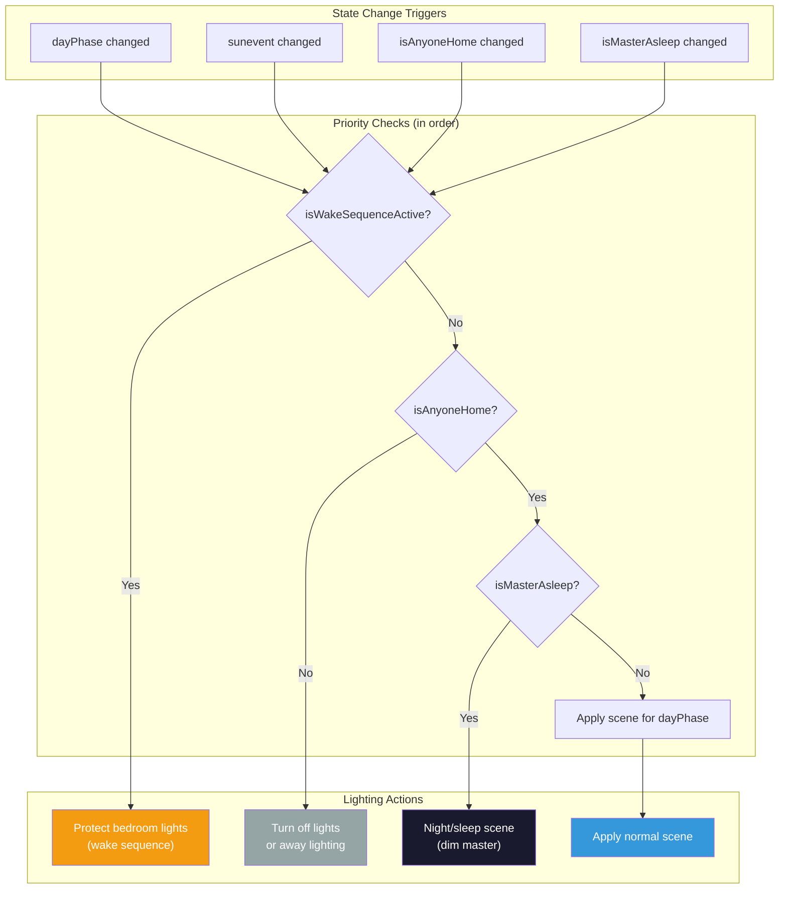
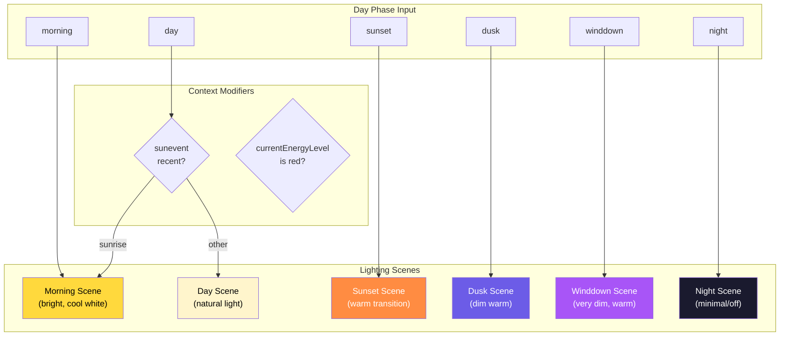
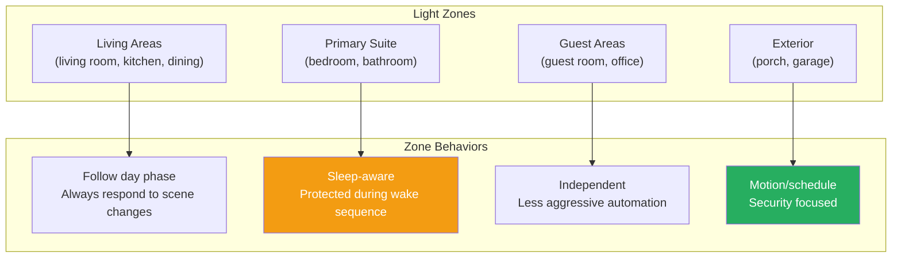
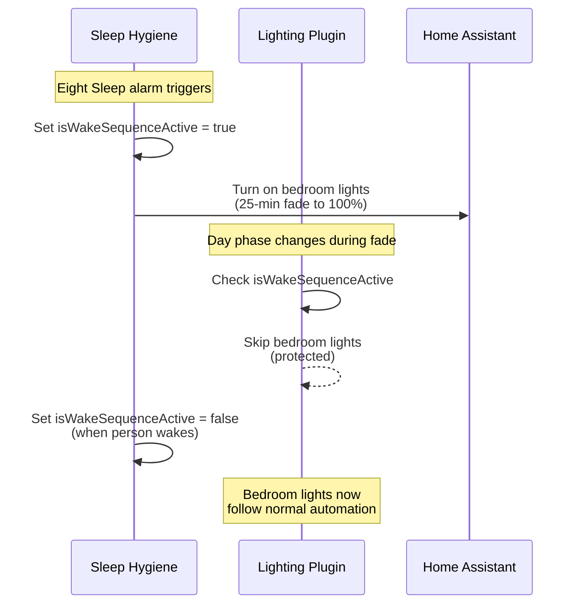
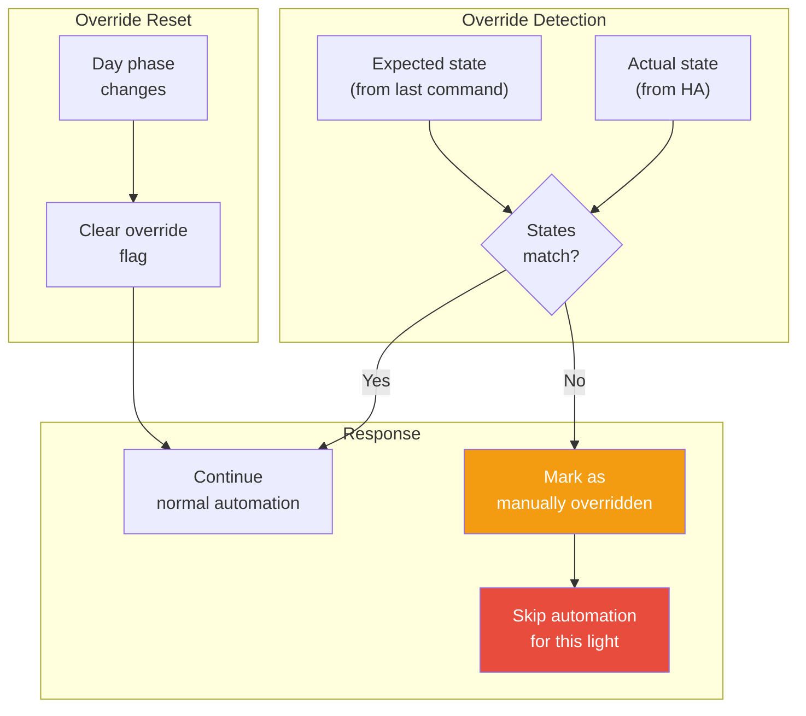
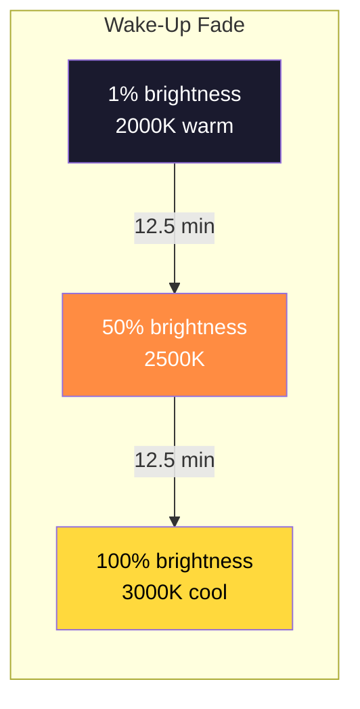
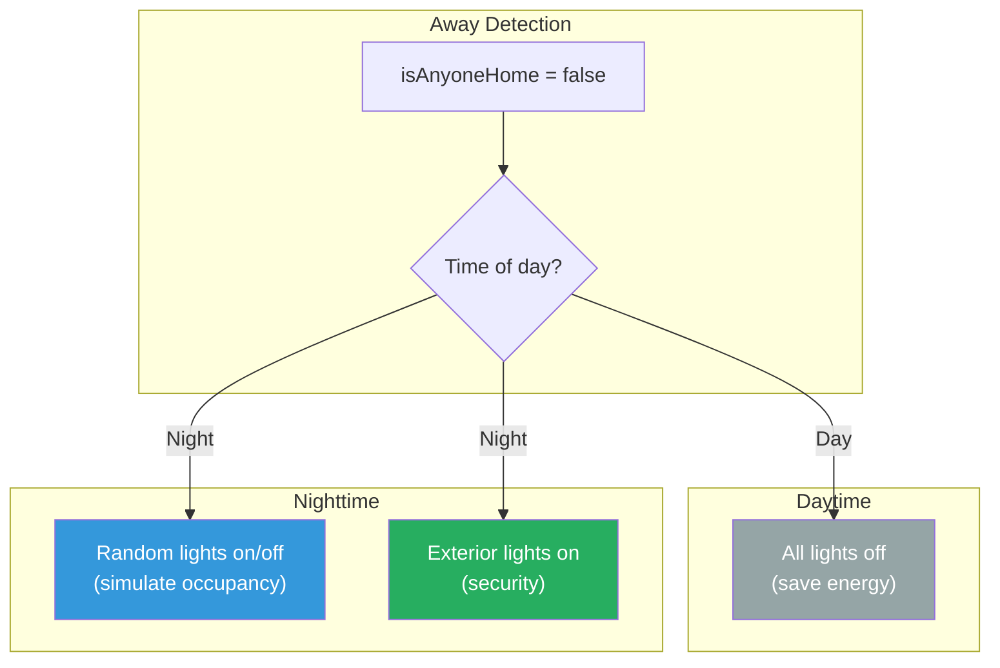

# Lighting Control Flow

This document describes the lighting automation flow, which manages whole-home lighting based on day phase, presence, and sleep state.

## Overview

The lighting plugin provides intelligent lighting control by:
1. Calculating scenes based on day phase and context
2. Respecting manual overrides and protection modes
3. Managing transitions for natural light progression
4. Supporting special scenarios (wake-up, away mode)

## Lighting Scene Selection

## Day Phase to Scene Mapping

Each day phase corresponds to a pre-configured lighting scene:

### Scene Details

| Day Phase | Scene | Brightness | Color Temp | Notes |
|-----------|-------|------------|------------|-------|
| morning | Morning | 100% | 4000K (cool) | Energizing wake-up light |
| day | Day | 80-100% | 4500K (natural) | Full daylight simulation |
| sunset | Sunset | 60-80% | 3000K (warm) | Golden hour transition |
| dusk | Dusk | 40-60% | 2700K (warm) | Evening relaxation |
| winddown | Winddown | 20-40% | 2200K (candle) | Pre-sleep dimming |
| night | Night | 1-10% | 2000K (dim red) | Minimal for navigation |

## Light Group Management

Lights are organized into zones with different behaviors:

## Wake Sequence Protection

During the wake-up sequence, bedroom lights are protected from normal lighting automation:

## Manual Override Detection

The lighting plugin respects manual changes:

## Edge-Triggered Activation (skip_reactivation_when_on)

Some rooms use presence sensors (e.g. mmWave radar) that briefly drop detection on stationary people, then re-detect. Without protection, every re-detection re-fires the scene and overrides manual brightness adjustments.

The per-room `skip_reactivation_when_on: true` config flag makes activation **edge-triggered**: if the room's last applied action was already `"on"`, a repeat `"on"` evaluation from an occupancy or condition trigger is skipped, preserving any brightness the user dialed in since last activation.

**Exceptions — triggers that always re-fire regardless of this flag:**
- `dayPhase` changes (different target scene)
- `sunevent` changes
- Empty/reset triggers (startup initialization)

Currently used by: Kitchen (Apollo MTR mmWave radar)

## Transition Timing

Light transitions use appropriate timing for natural progression:

| Transition Type | Duration | Use Case |
|-----------------|----------|----------|
| Immediate | 0s | Emergency/security |
| Quick | 2s | Manual toggles |
| Normal | 60s | Phase transitions |
| Slow | 300s (5 min) | Sunset/dusk |
| Wake | 1500s (25 min) | Morning wake-up |

## Scene Activation Reliability

The lighting plugin protects against two Hue Bridge interaction quirks that
manifest when a person arrives home from an "away" state:

### Per-room debounce of evaluations

Arrival flips several presence variables in a sub-second burst — `isNickHome`,
`isAnyOwnerHome`, `isAnyoneHome`, `didOwnerJustReturnHome`,
`isAnyoneHomeAndAwake`. Each one triggers a room re-evaluation. Without
coalescing, the lighting plugin fires the same `scene.turn_on` several times
back-to-back, which destabilizes Hue scenes with `auto_dynamic: true`.

`evaluateAndActivateRoom` debounces per-room: subsequent calls within
`defaultLightingDebounceDelay` (300ms) reset the timer and accumulate the
trigger names. When the timer fires, a single evaluation runs against the
most recent state, with a `debounced:...` trigger string for log
observability. This mirrors the music plugin's zone-resolution debounce.

### Two-step recall for dynamic scenes

Rooms with `has_dynamics: true` in `hue_config.yaml` (e.g. Primary Suite)
use Hue scenes whose `auto_dynamic` flag is on — the bridge runs an animated
palette autonomously after recall. The bridge can fail to start the palette
on bulbs that were off pre-recall (still mid-transition from the on
command), leaving each bulb reverted to off at staggered times.

`activateScene` works around this by issuing two calls:

1. `scene.turn_on` with `dynamic: false` — static recall; bulbs settle at the
   scene's base colors and brightness.
2. After `twoStepRecallGap` (500ms), `scene.turn_on` with `dynamic: true` —
   palette starts from a stable known state.

The dynamic phase fires asynchronously via a timer callback. If the
room-scoped context is cancelled during the gap (a newer evaluation came
in), the dynamic phase is skipped.

Rooms without `has_dynamics` make a single recall, with no `dynamic` key,
deferring to the scene's own configuration.

The 2026-05-25 production incident — three rapid scene recalls during
arrival, dynamic palette failure, bedroom lights going off, statetracking
incorrectly marking the occupants as asleep — drove both protections.

## Away Mode Lighting

When no one is home, lighting enters away mode:

## Related Documentation

- [DAY_PHASE_MODES.md](./DAY_PHASE_MODES.md) - Day phase calculation and schedule configuration
- [SLEEP_HYGIENE.md](./SLEEP_HYGIENE.md) - Wake-up sequence that protects bedroom lights
- [ENERGY_MANAGEMENT.md](./ENERGY_MANAGEMENT.md) - Energy-aware lighting adjustments
- [PLUGIN_SYSTEM.md](../reference/PLUGIN_SYSTEM.md) - Plugin architecture
