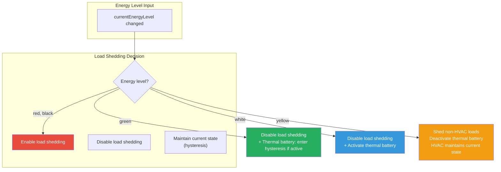
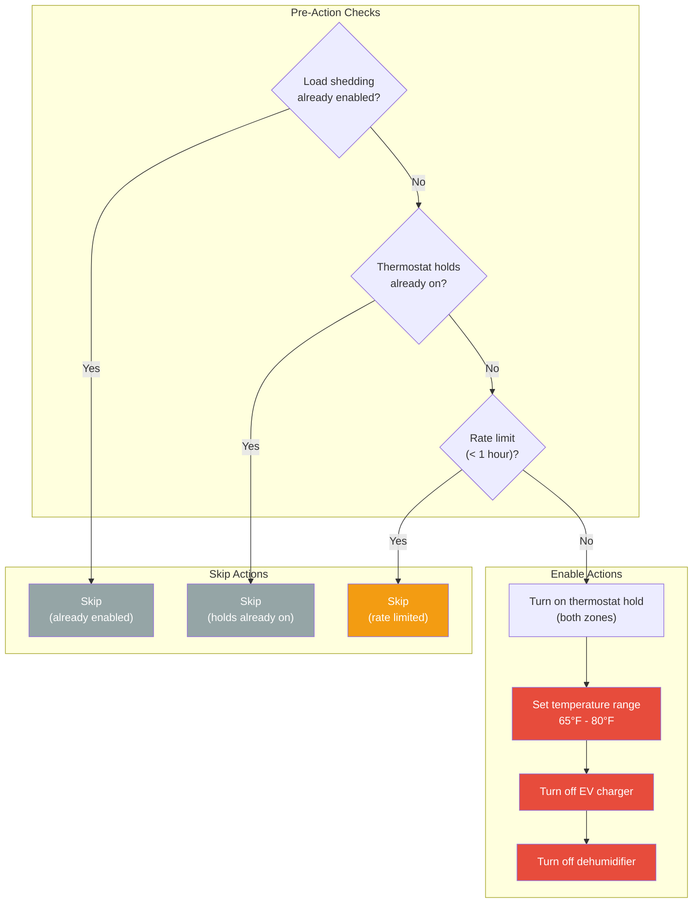
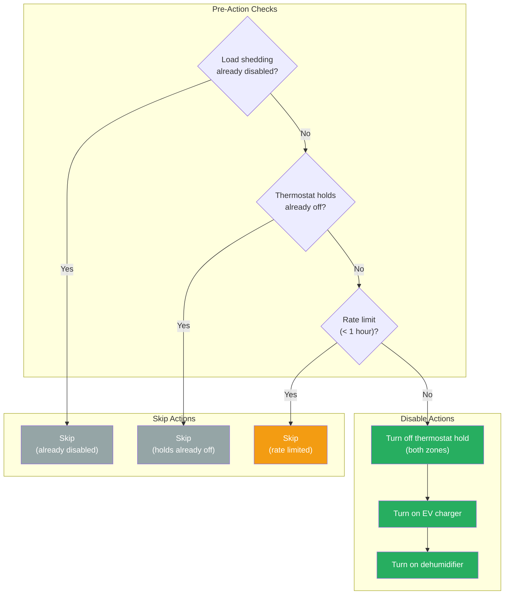
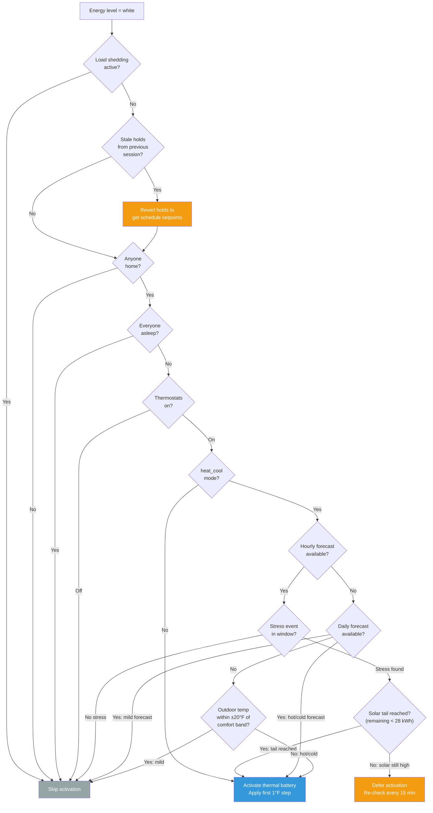
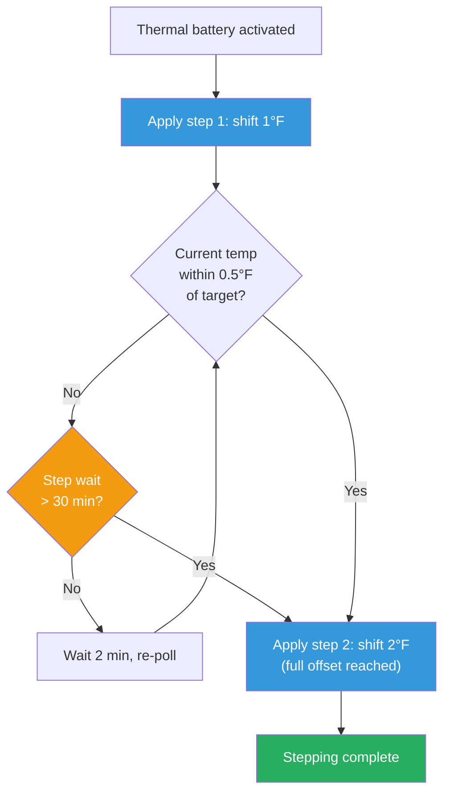
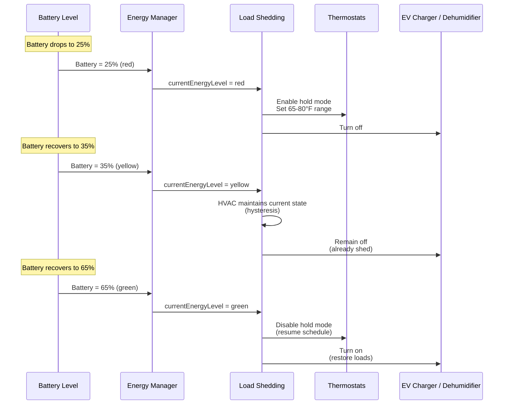
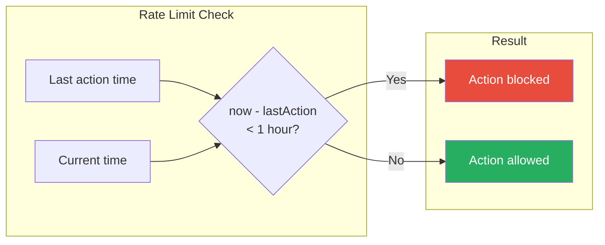

# Load Shedding Flow

This document describes the load shedding automation flow, which manages HVAC thermostat control and EV charger based on energy availability.

## Overview

The load shedding plugin controls thermostats, EV charger, and dehumidifier based on energy levels to:
1. Restrict HVAC, disable EV charger, and disable dehumidifier when battery is low (red/black)
2. Return to normal schedules and re-enable EV charger and dehumidifier when energy is available (green/white)
3. **Thermal battery**: Pre-condition the house by shifting HVAC setpoints when energy is abundant (white)
4. Shed non-HVAC loads (EV charger, dehumidifier) at yellow while maintaining HVAC hysteresis

## Energy Level Response

## Thermostat Control

### Enable Load Shedding (Low Energy)

### Disable Load Shedding (Energy Restored)

## Thermal Battery (Energy Level White)

When energy is abundant (white level), the plugin pre-conditions the house by shifting HVAC setpoints, storing thermal energy in the building mass. This reduces HVAC demand later if energy levels drop.

### Activation Guards

### Gradual Stepping

To avoid triggering auxiliary heat strips, the total offset (2°F) is applied **gradually in 1°F steps** rather than all at once. After each step, a background goroutine polls the thermostat's `current_temperature` to confirm the house has nearly reached the new setpoint before applying the next step.

| Parameter | Value | Description |
|-----------|-------|-------------|
| Step size | 1°F | Offset applied per step |
| Total offset | 2°F | Full thermal battery shift |
| Poll interval | 2 min | How often to check thermostat temperature |
| Proximity threshold | 0.5°F | How close current temp must be to target |
| Safety timeout | 30 min | Max wait per step before forcing next step |

### Setpoint Shifting

| HVAC Mode | Offset Direction | Effect |
|-----------|-----------------|--------|
| `cool` | Setpoint **down** 2°F | Pre-cool the house |
| `heat` | Setpoint **up** 2°F | Pre-heat the house |
| `heat_cool`/`auto` | Entire band shifts based on weather forecast (or outdoor temp fallback) | See below |

**`heat_cool`/`auto` mode** uses a three-level forecast cascade to determine shift direction and timing:

1. **Hourly forecast** (primary) — `weather.get_forecasts` with `type=hourly`. Scans forward from now for the first hour where outdoor temp falls outside the comfort band ± 5°F margin.
   - **No stress in window** → skip entirely.
   - **Stress found, remaining solar > 28 kWh** → defer activation; re-check every 15 min until solar tail is reached.
   - **Solar tail reached (remaining ≤ 28 kWh)** → activate now.
   - Direction: temp below band → pre-heat (shift **up**); temp above band → pre-cool (shift **down**).
   - Note: the hourly comfort margin (±5°F) is intentionally tighter than the daily skip margin (±20°F); the two paths use different thresholds by design.

2. **Daily forecast** (fallback when hourly unavailable) — `weather.get_forecasts` with `type=daily`. Tries `weather.strawberry_creek` first, then `weather.forecast_home_2`.
   - **Skip logic**: Skip only if **both** forecast high AND low fall within the comfort band ± 20°F margin.
   - **Direction**: If forecast high exceeds the skip zone → pre-cool (shift **down**). If forecast low falls below → pre-heat (shift **up**).

3. **Outdoor temp sensor** (tertiary fallback) — `sensor.weather_station_temperature`. Single-point logic: cold (below comfort band - 20°F) → shift **up**; hot (above + 20°F) → shift **down**; mild → **skipped**.

| Parameter | Value | Description |
|-----------|-------|-------------|
| Hourly comfort margin | 5°F | Outside comfort band to consider "stress" (hourly path) |
| Solar tail threshold | 28 kWh | Activate when remaining solar forecast drops below this |
| Deferral recheck interval | 15 min | How often to re-evaluate while deferred |
| Daily skip margin | 20°F | Comfort band expansion for daily skip logic |

Original setpoints are saved and restored on deactivation.

### Deactivation Triggers

Thermal battery **hard-deactivates** — or, if deferred, the pending activation is cancelled — when:
- Energy level drops to **yellow, red, or black**
- Nobody is home (`isAnyoneHome` → false)
- Everyone falls asleep (`isEveryoneAsleep` → true)

**Green dip → Hysteresis (not deactivation)**

When energy dips white→green while the thermal battery is active, the plugin enters a 4-hour hysteresis window instead of reverting setpoints. During hysteresis:
- `heat_cool`/`auto` thermostats: band is widened (saved low + shifted high, or shifted low + saved high) so neither heating nor cooling engages
- `heat`/`cool` thermostats: setpoint reverts to saved value to stop the equipment
- Thermostat holds **remain enabled**
- If energy returns to white during the window, preheat resumes (saved setpoints and step counter are still valid)
- If energy drops to yellow/red/black, hard deactivation runs immediately (hysteresis timer cancelled, setpoints reverted)
- If the window expires without recovery, holds are released and the climate schedule resumes (no explicit setpoint revert — the schedule is more correct than a stale saved value)

Any in-progress stepping goroutine and any deferred-activation recheck timer are cancelled on deactivation.

## Yellow State — Partial Load Shedding

The yellow (moderate) energy state applies partial load shedding: non-HVAC loads are shed, but HVAC maintains its current state (hysteresis) to prevent rapid toggling of thermostats.

**Yellow actions:**
- Shed non-HVAC loads (EV charger, dehumidifier)
- Deactivate thermal battery (energy is declining, stop pre-conditioning)
- HVAC unchanged (hysteresis buffer prevents rapid toggling)

HVAC hysteresis prevents rapid toggling at threshold boundaries (e.g., 29%↔31% repeatedly enabling/disabling). Non-HVAC loads are simpler to toggle and don't have the same wear concerns, so they are shed at yellow to conserve energy.

## Controlled Entities

| Entity | Type | Description |
|--------|------|-------------|
| `switch.most_of_house_thermostat_hold` | Thermostat | Main zone hold mode |
| `switch.primary_suite_thermostat_hold` | Thermostat | Primary suite hold mode |
| `climate.most_of_house_thermostat` | Thermostat | Main zone climate control |
| `climate.primary_suite_thermostat` | Thermostat | Primary suite climate control |
| `switch.leaf_charger` | EV Charger | Nissan Leaf charger plug |
| `switch.dehumidifier_power_control` | Dehumidifier | Whole-house dehumidifier |

## Temperature Range

| Mode | Low | High | Description |
|------|-----|------|-------------|
| Normal | (schedule) | (schedule) | Follow programmed schedule |
| Load Shedding | 65°F | 80°F | Wider range = less HVAC runtime |

The 65-80°F range allows:
- Winter: Let home cool to 65°F before heating
- Summer: Let home warm to 80°F before cooling

## Rate Limiting

A 1-hour minimum interval between actions prevents:
- Rapid toggling from energy level fluctuations
- Excessive wear on HVAC equipment
- User frustration from constant changes

## State Variables

### Inputs

| Variable | Type | Source | Description |
|----------|------|--------|-------------|
| `currentEnergyLevel` | string | Energy Plugin | Overall energy availability |
| `isAnyoneHome` | bool | State Tracking Plugin | Whether anyone is home (thermal battery guard) |
| `isEveryoneAsleep` | bool | State Tracking Plugin | Whether everyone is asleep (thermal battery guard) |
| `remainingSolarGeneration` | number | Energy Plugin | Remaining solar kWh forecast; gate defers while above threshold |

### Internal State

| Variable | Type | Description |
|----------|------|-------------|
| `loadSheddingOn` | bool | Current full load shedding state (HVAC + non-HVAC) |
| `nonHVACLoadsShed` | bool | Whether non-HVAC loads (EV charger, dehumidifier) are shed |
| `lastAction` | time | Timestamp of last action (rate limiting) |
| `thermalBatteryActive` | bool | Whether thermal battery is currently active |
| `thermalBatteryHysteresisActive` | bool | Whether thermal battery is in wide-band hysteresis after a green dip |
| `thermalBatteryHysteresisExpiresAt` | time | When the current hysteresis window expires |
| `savedSetpoints` | map | Original thermostat setpoints saved for restoration |

## Related Documentation

- [ENERGY_MANAGEMENT.md](./ENERGY_MANAGEMENT.md) - Energy level calculation
- [DAY_PHASE_MODES.md](./DAY_PHASE_MODES.md) - Schedule configuration
- [PLUGIN_SYSTEM.md](../reference/PLUGIN_SYSTEM.md) - Plugin architecture
