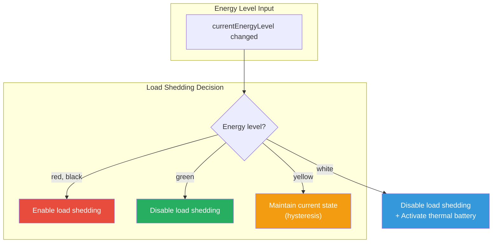
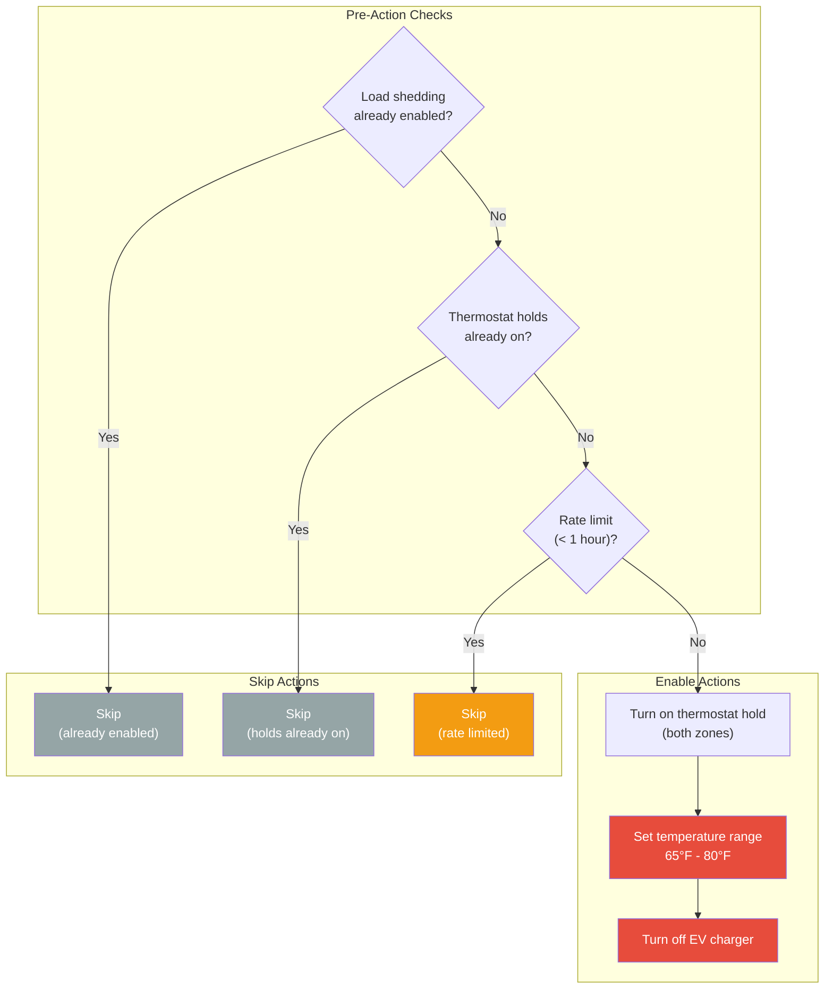
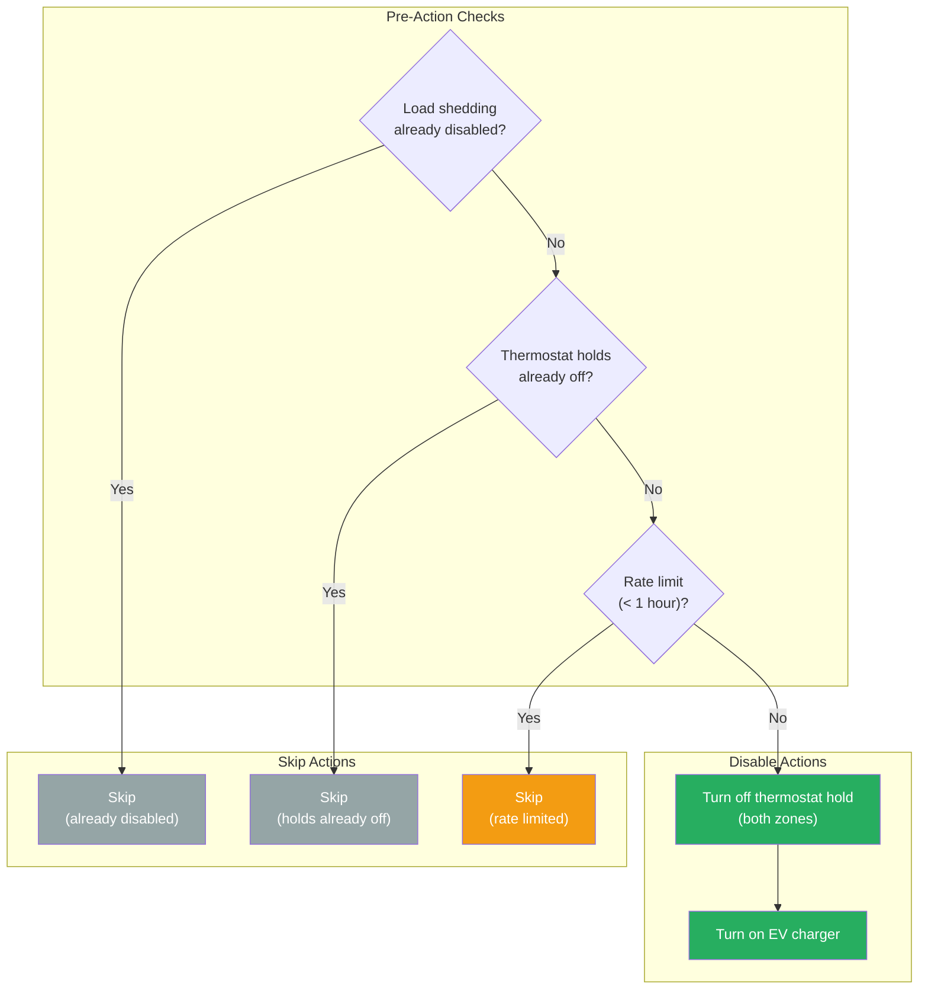
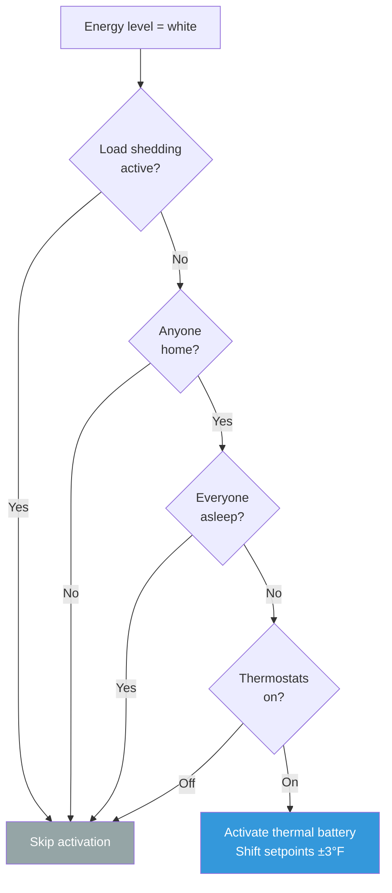
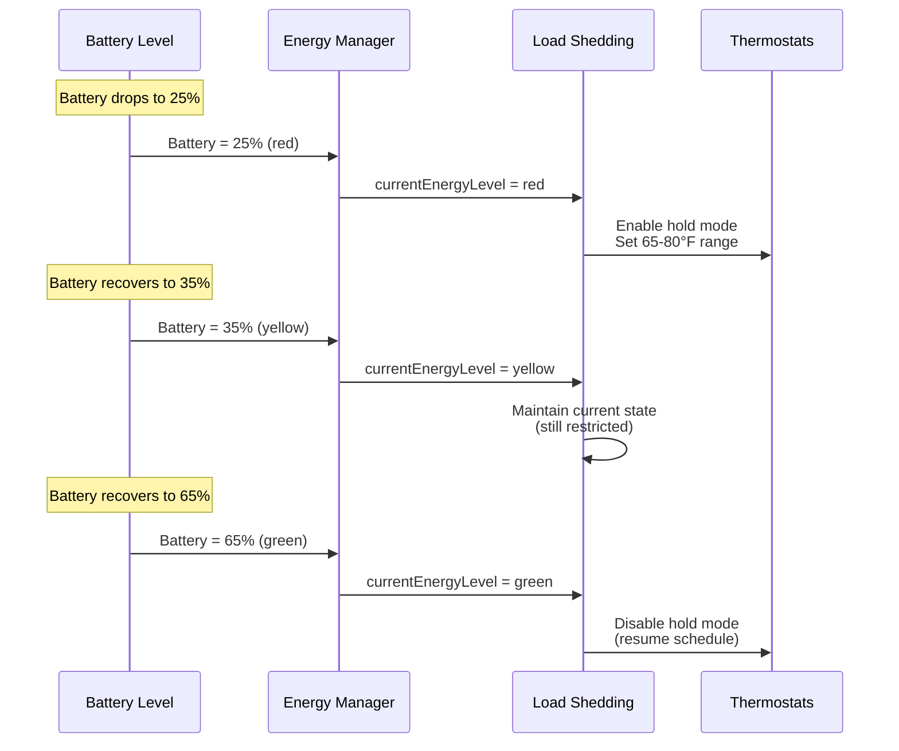
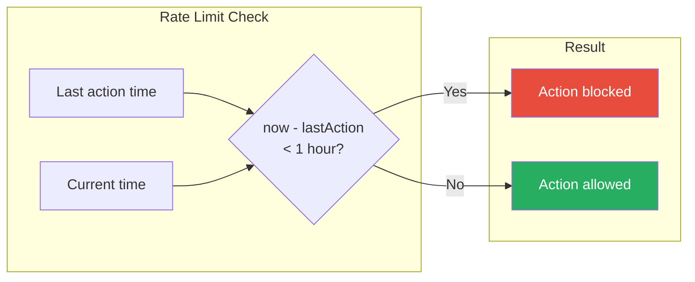

# Load Shedding Flow

This document describes the load shedding automation flow, which manages HVAC thermostat control and EV charger based on energy availability.

## Overview

The load shedding plugin controls thermostats and EV charger based on energy levels to:
1. Restrict HVAC and disable EV charger when battery is low (red/black)
2. Return to normal schedules and re-enable EV charger when energy is available (green/white)
3. **Thermal battery**: Pre-condition the house by shifting HVAC setpoints when energy is abundant (white)
4. Maintain hysteresis to prevent rapid toggling (yellow)

## Energy Level Response

## Thermostat Control

### Enable Load Shedding (Low Energy)

### Disable Load Shedding (Energy Restored)

## Thermal Battery (Energy Level White)

When energy is abundant (white level), the plugin pre-conditions the house by shifting HVAC setpoints, storing thermal energy in the building mass. This reduces HVAC demand later if energy levels drop.

### Activation Guards

### Setpoint Shifting

| HVAC Mode | Offset Direction | Effect |
|-----------|-----------------|--------|
| `cool` | Setpoint **down** 3°F | Pre-cool the house |
| `heat` | Setpoint **up** 3°F | Pre-heat the house |
| `heat_cool`/`auto` | Low **up** 3°F, High **down** 3°F | Shift both bounds inward |

Original setpoints are saved and restored on deactivation.

### Deactivation Triggers

Thermal battery deactivates (reverting to original setpoints) when:
- Energy level drops below white (green, yellow, red, or black)
- Nobody is home (`isAnyoneHome` → false)
- Everyone falls asleep (`isEveryoneAsleep` → true)

## Yellow State Hysteresis

The yellow (moderate) energy state acts as a buffer to prevent rapid toggling:

Without hysteresis, the system would rapidly toggle at threshold boundaries (e.g., 29%↔31% repeatedly enabling/disabling).

## Controlled Entities

| Entity | Type | Description |
|--------|------|-------------|
| `switch.most_of_house_thermostat_hold` | Thermostat | Main zone hold mode |
| `switch.primary_suite_thermostat_hold` | Thermostat | Primary suite hold mode |
| `climate.most_of_house_thermostat` | Thermostat | Main zone climate control |
| `climate.primary_suite_thermostat` | Thermostat | Primary suite climate control |
| `switch.leaf_charger` | EV Charger | Nissan Leaf charger plug |

## Temperature Range

| Mode | Low | High | Description |
|------|-----|------|-------------|
| Normal | (schedule) | (schedule) | Follow programmed schedule |
| Load Shedding | 65°F | 80°F | Wider range = less HVAC runtime |

The 65-80°F range allows:
- Winter: Let home cool to 65°F before heating
- Summer: Let home warm to 80°F before cooling

## Rate Limiting

A 1-hour minimum interval between actions prevents:
- Rapid toggling from energy level fluctuations
- Excessive wear on HVAC equipment
- User frustration from constant changes

## State Variables

### Inputs

| Variable | Type | Source | Description |
|----------|------|--------|-------------|
| `currentEnergyLevel` | string | Energy Plugin | Overall energy availability |
| `isAnyoneHome` | bool | State Tracking Plugin | Whether anyone is home (thermal battery guard) |
| `isEveryoneAsleep` | bool | State Tracking Plugin | Whether everyone is asleep (thermal battery guard) |

### Internal State

| Variable | Type | Description |
|----------|------|-------------|
| `loadSheddingOn` | bool | Current load shedding state |
| `lastAction` | time | Timestamp of last action (rate limiting) |
| `thermalBatteryActive` | bool | Whether thermal battery is currently active |
| `savedSetpoints` | map | Original thermostat setpoints saved for restoration |

## Related Documentation

- [ENERGY_MANAGEMENT.md](./ENERGY_MANAGEMENT.md) - Energy level calculation
- [DAY_PHASE_MODES.md](./DAY_PHASE_MODES.md) - Schedule configuration
- [PLUGIN_SYSTEM.md](../reference/PLUGIN_SYSTEM.md) - Plugin architecture
