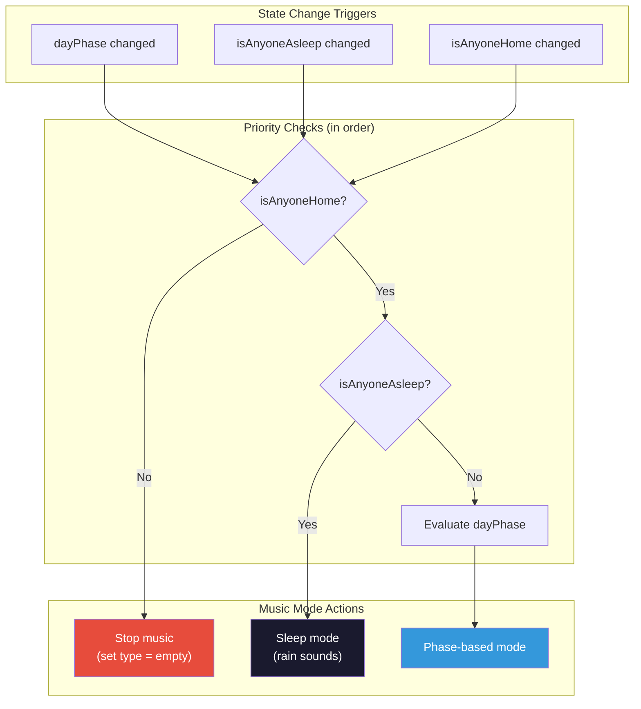
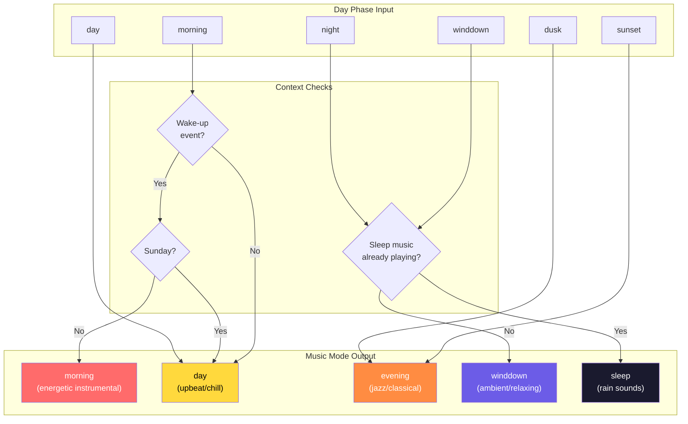
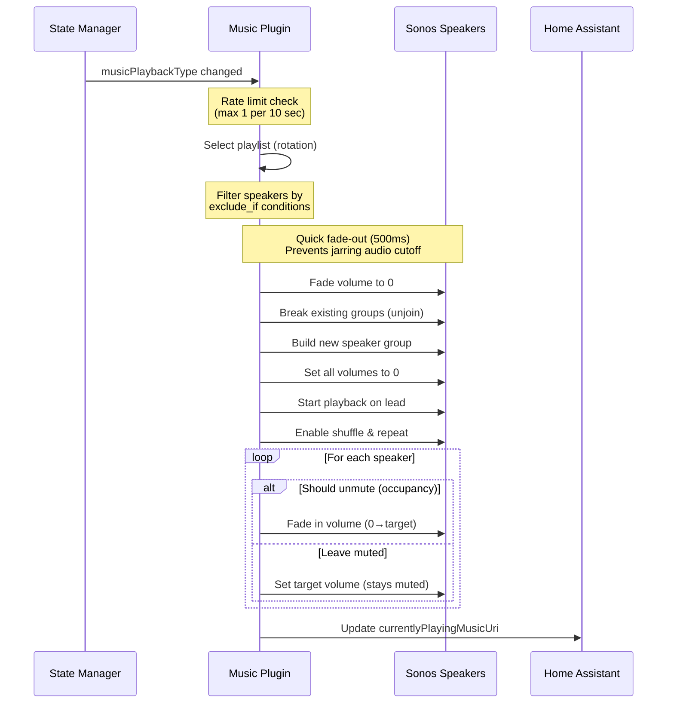
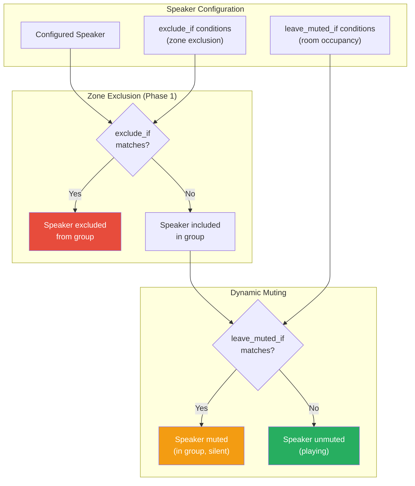
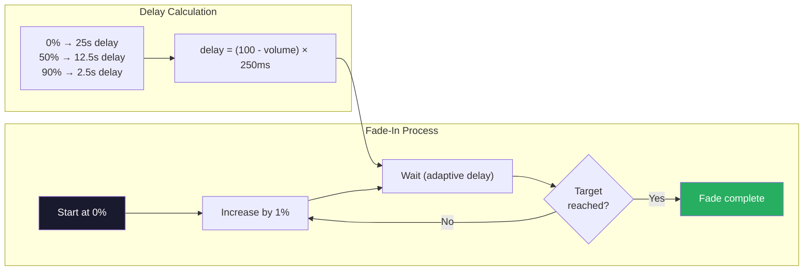
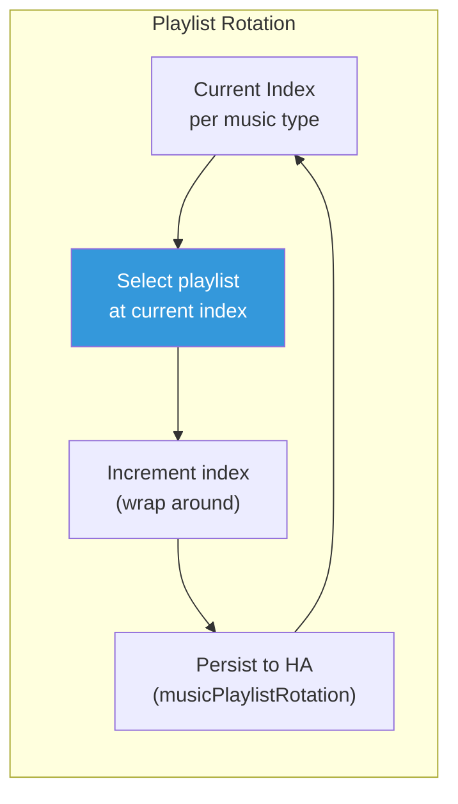

# Music Playback Flow

This document describes the music playback automation flow, which manages whole-home audio based on day phase, sleep state, and room occupancy.

## Overview

The music plugin coordinates Sonos speaker playback by:
1. Selecting appropriate music mode based on day phase and sleep state
2. Building speaker groups with the right participants
3. Applying room-specific volume and mute conditions
4. Managing playlist rotation for variety

## Music Mode Selection



## Day Phase to Music Mode Mapping

The music mode is determined by the current day phase with additional context:



### Music Mode Details

| Music Mode | Day Phases | Playlist Style | Notes |
|------------|------------|----------------|-------|
| `morning` | morning (wake-up only) | Instrumental melodic house/techno, epic classical | Only plays on wake-up events; skipped on Sundays |
| `day` | morning (no wake-up), day | Kygo, chill tracks, soft house, country | Default daytime music |
| `evening` | sunset, dusk | Instrumental study, jazz, classical, chilled jazz | Calmer evening music |
| `winddown` | winddown, night | Floating through space, ambient relaxation | Pre-sleep relaxation |
| `sleep` | (triggered by sleep state) | Rain sounds | Triggered by isAnyoneAsleep, not day phase |
| `wakeup` | (alarm trigger) | Ambient relaxation | Gentle wake-up music (set by sleep hygiene plugin) |

## Playback Orchestration

When a music mode is selected, the following sequence executes:



## Speaker Zone Management

Speakers are filtered by `exclude_if` conditions at orchestration time, then muted/unmuted based on `leave_muted_if` conditions:



### Occupancy-Based Muting Example

```yaml
# From music_config.yaml
participants:
  - player_name: "Office"
    base_volume: 6
    leave_muted_if:
      - variable: "isNickOfficeOccupied"
        value: false
```

When `isNickOfficeOccupied` changes from `false` to `true`:
1. Music plugin detects the mute condition variable change
2. Re-evaluates the speaker's mute conditions
3. Unmutes the Office speaker (already at target volume)

## Volume Fade-In

Speakers fade in gradually to avoid sudden loud sounds:



### Human Override Detection

During fade-in, if the actual volume is significantly lower than expected (>2% difference), the system assumes a human manually lowered the volume and aborts the fade.

## Quick Fade-Out on Transitions

When playback mode changes or music stops, speakers perform a quick fade-out (500ms) before ungrouping or stopping. This prevents jarring audio cutoffs when:

- Switching between music types (e.g., day → evening)
- Stopping playback entirely
- Regrouping speakers for a new configuration

The fade-out uses 5 steps at 100ms intervals, smoothly reducing volume from current level to zero before any speaker group changes occur.

> **Note:** This is different from the gradual sleep music fade-out (5+ minutes) used during wake sequences. See [SLEEP_HYGIENE.md](./SLEEP_HYGIENE.md) for the wake sequence fade-out.

## Playlist Rotation

Playlists rotate to provide variety:



## Related Documentation

- [DAY_PHASE_MODES.md](./DAY_PHASE_MODES.md) - Day phase calculation and schedule configuration
- [SLEEP_HYGIENE.md](./SLEEP_HYGIENE.md) - Wake-up sequence and sleep music triggers
- [PLUGIN_SYSTEM.md](../reference/PLUGIN_SYSTEM.md) - Plugin architecture
- [SHADOW_STATE.md](../reference/SHADOW_STATE.md) - Shadow state pattern for debugging
