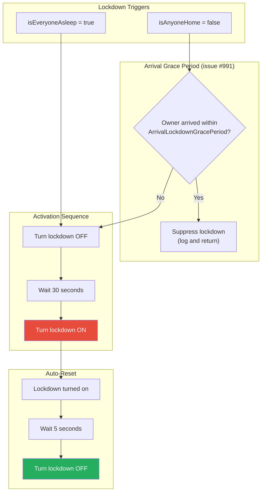
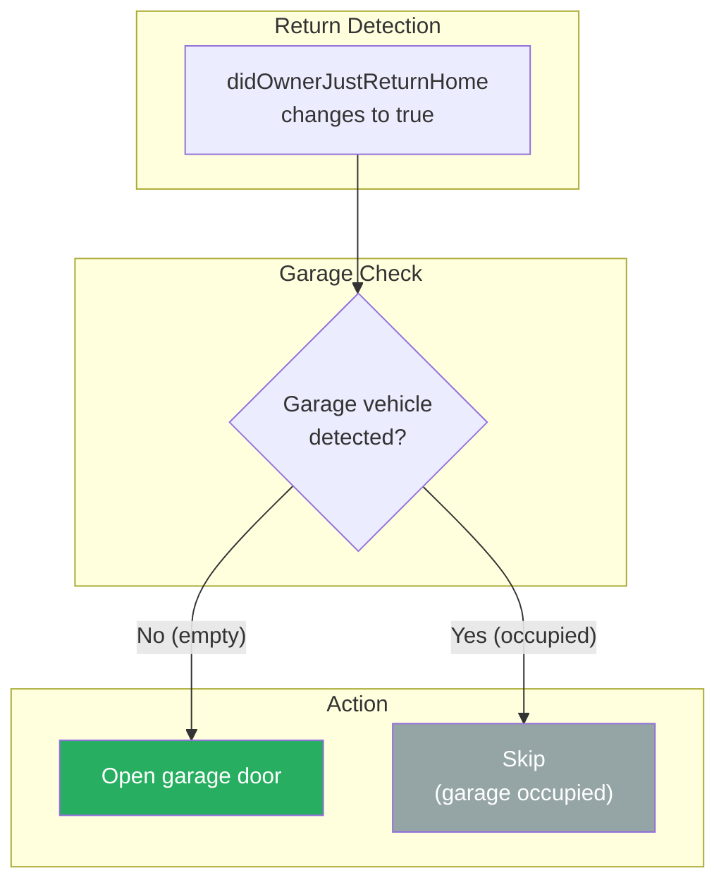
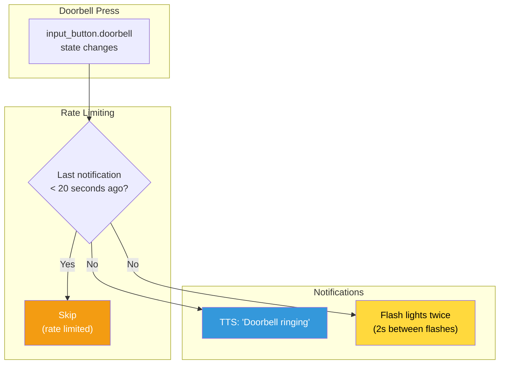
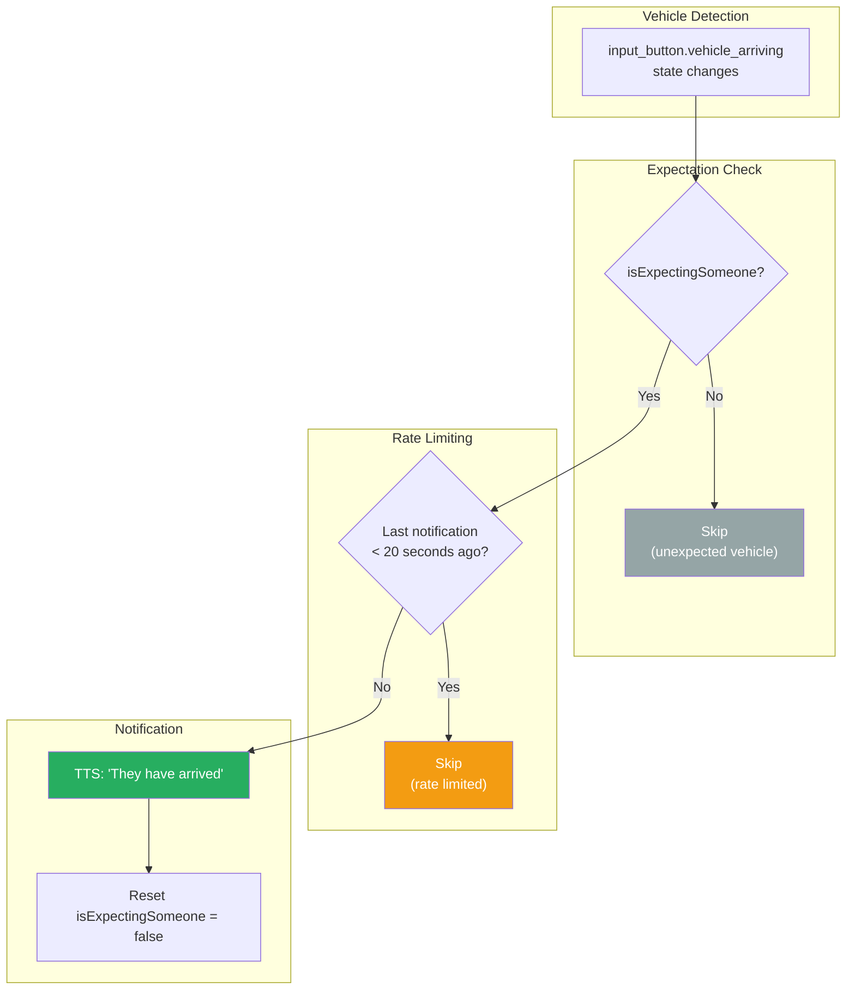

# Security Flow

This document describes the security automation flow, which manages lockdown mode, garage automation, doorbell notifications, and visitor detection.

## Overview

The security plugin provides:
1. Automatic lockdown activation (away or asleep)
2. Garage door automation for returning owners
3. Doorbell press notifications (TTS + light flash)
4. Expected vehicle arrival announcements

## Lockdown Activation

Lockdown mode activates when no one is home or everyone is asleep:

### Why Turn Off First?

The off-wait-on sequence ensures Home Assistant automations detect a clear state change, even if lockdown was already active. This guarantees door locks, cameras, and other security devices receive the activation signal.

### Auto-Reset Purpose

The 5-second auto-reset allows lockdown to be a "pulse" trigger rather than a persistent state. External automations can subscribe to the lockdown turning on, perform their actions, and the lockdown resets for the next trigger.

## Garage Door Automation

When an owner returns home, the garage door opens automatically if the garage is empty:

### Vehicle Detection

The garage uses a sensor (`binary_sensor.garage_door_vehicle_detected`) to determine if a vehicle is present:
- **off** = Garage is empty, safe to open
- **on** = Vehicle detected, don't open (would hit the car)

## Doorbell Notifications

When the doorbell button is pressed, notifications are sent via TTS and light flash:

### Doorbell Notification Targets

**TTS Speakers:**
- Bedroom
- Kitchen
- Dining Room
- Soundbar
- Kids Bathroom

**Flashing Lights:**
- Primary Suite
- Living Room
- Independent (office/guest area)

## Vehicle Arrival Notifications

When expecting someone and a vehicle is detected arriving:

## State Variables

### Inputs

| Variable | Type | Description |
|----------|------|-------------|
| `isAnyoneHome` | bool | Anyone present in the home |
| `isEveryoneAsleep` | bool | All tracked people asleep |
| `didOwnerJustReturnHome` | bool | Owner arrived recently |
| `isExpectingSomeone` | bool | Expecting a visitor |

### Home Assistant Entities

| Entity | Type | Purpose |
|--------|------|---------|
| `input_boolean.lockdown` | Toggle | Security lockdown state |
| `input_button.doorbell` | Button | Doorbell press trigger |
| `input_button.vehicle_arriving` | Button | Vehicle detection trigger |
| `binary_sensor.garage_door_vehicle_detected` | Sensor | Garage occupancy |
| `cover.garage_door_door` | Cover | Garage door control |

## Timing Constants

| Constant | Duration | Purpose |
|----------|----------|---------|
| Lockdown clear delay | 30 seconds | Time to wait before re-activating lockdown |
| Lockdown reset delay | 5 seconds | Time before auto-resetting lockdown |
| `ArrivalLockdownGracePeriod` | 5 minutes | Suppress "no one home" lockdown after recent owner arrival |
| Doorbell rate limit | 20 seconds | Minimum time between doorbell notifications |
| Doorbell flash delay | 2 seconds | Delay between light flashes |
| Vehicle rate limit | 20 seconds | Minimum time between vehicle notifications |

## Related Documentation

- [STATE_TRACKING.md](./STATE_TRACKING.md) - Provides isAnyoneHome, isEveryoneAsleep, didOwnerJustReturnHome
- [PLUGIN_SYSTEM.md](../reference/PLUGIN_SYSTEM.md) - Plugin architecture
