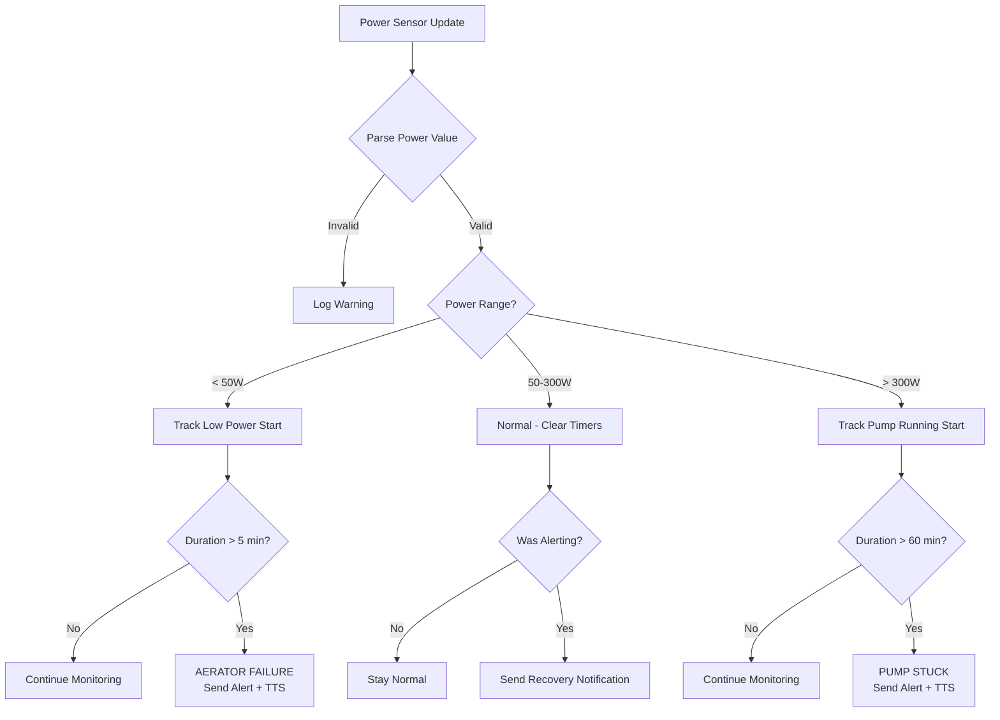
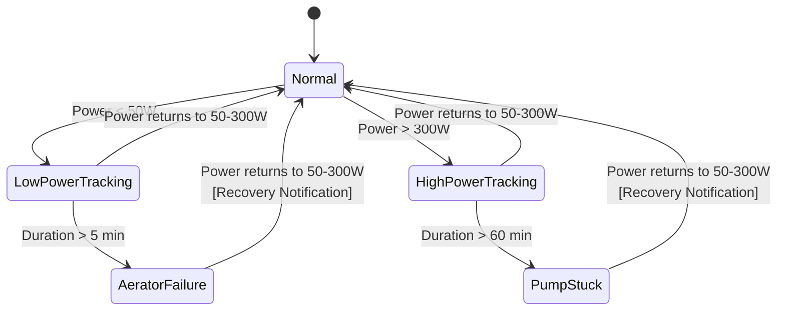

# Septic System Monitoring

This document describes the aerobic septic system monitoring logic implemented in the Infrastructure plugin.

## Overview

The aerobic septic system has two main electrical loads monitored via a SPAN circuit power sensor:

| Component | Power Draw | Behavior |
|-----------|------------|----------|
| **Aerator** | ~100W baseline | Runs continuously to oxygenate the tank |
| **Pump** | 500-600W | Runs in short cycles to spray treated water |

The Infrastructure plugin monitors `sensor.span_left_most_of_house_aerobic_septic_system_power` to detect failure conditions.

## Failure Detection



## Alert Thresholds

| Condition | Threshold | Debounce | Severity |
|-----------|-----------|----------|----------|
| Aerator Failure | Power < 50W | 5 minutes | Urgent |
| Pump Stuck Running | Power > 300W | 60 minutes | Urgent |

## Notification Flow

### Failure Alerts

When a failure condition is detected:

1. **ntfy Push Notification** (urgent priority)
   - Title: "Septic System Alert"
   - Tags: `warning`, `toilet`

2. **TTS Announcement** via Sonos speakers
   - Speakers: bedroom, kitchen, dining room, soundbar, kids bathroom
   - Uses Google Translate TTS

### Recovery Notifications

When the system returns to normal:

1. **ntfy Push Notification** (default priority)
   - Title: "Septic System Recovered"
   - Tags: `white_check_mark`

2. **No TTS** for recovery (to avoid disruption)

## Rate Limiting

| Notification Type | Cooldown Period |
|-------------------|-----------------|
| Alert notifications | 4 hours |
| Recovery notifications | 30 minutes |

This prevents notification spam during intermittent issues.

## State Machine



## Shadow State

The plugin tracks its state via the Shadow State API at `/api/shadow/infrastructure`:

```json
{
  "plugin": "infrastructure",
  "inputs": {
    "current": {
      "sensor.span_left_most_of_house_aerobic_septic_system_power": "105.3"
    }
  },
  "outputs": {
    "septicSystemStatus": {
      "currentPowerW": 105.3,
      "systemState": "normal",
      "lastNormalPowerTime": "2026-01-25T10:30:00Z",
      "isAlerting": false
    },
    "activeAlerts": [],
    "lastNotification": null,
    "lastTTSAnnouncement": null
  }
}
```

## Configuration

The plugin uses hardcoded thresholds based on the system specifications:

```go
const (
    AeratorMinPowerW = 50.0              // Below = aerator failure
    PumpMaxNormalPowerW = 300.0          // Above = pump running
    AeratorFailureDebounceMinutes = 5    // Debounce for transient dips
    PumpStuckThresholdMinutes = 60       // Pump should cycle off within this time
)
```

## Entity Reference

| Entity | Type | Description |
|--------|------|-------------|
| `sensor.span_left_most_of_house_aerobic_septic_system_power` | Sensor | Power consumption in Watts |

## Related Documentation

- [Plugin System](../reference/PLUGIN_SYSTEM.md) - Plugin interfaces and lifecycle
- [Shadow State](../reference/SHADOW_STATE.md) - Shadow state pattern
- [Architecture](../architecture/ARCHITECTURE.md) - System architecture overview
