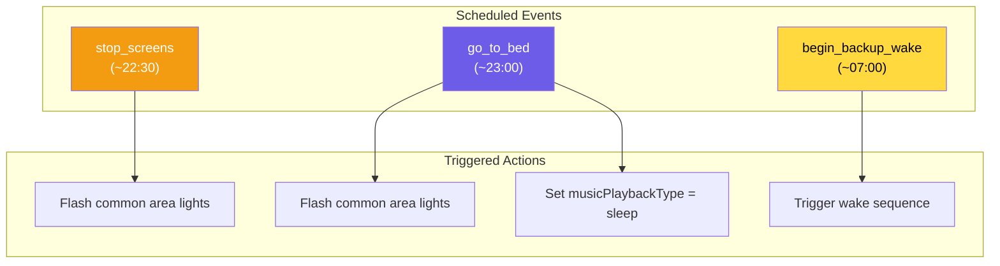
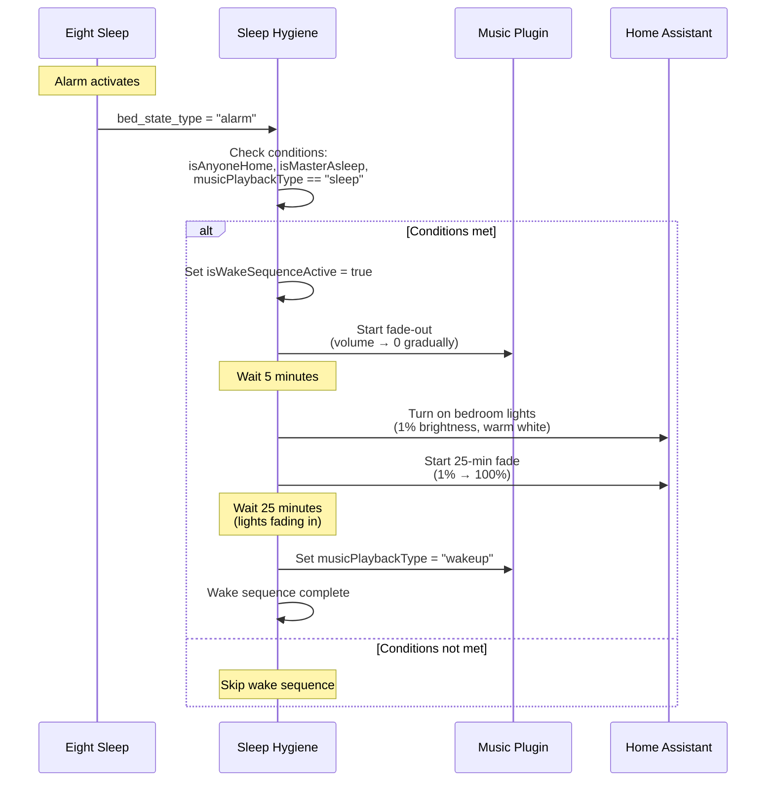
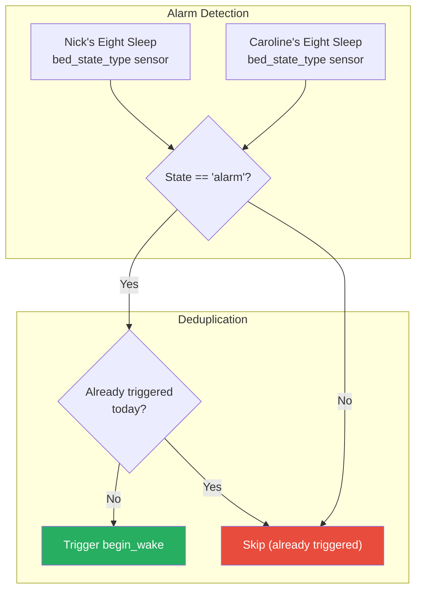
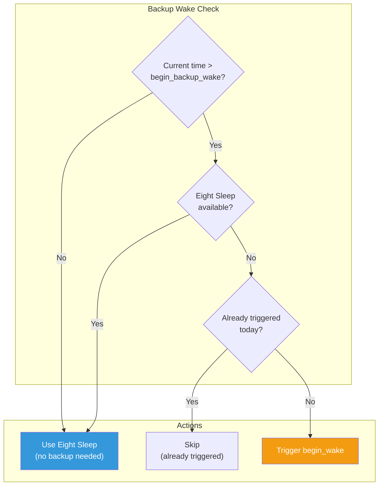
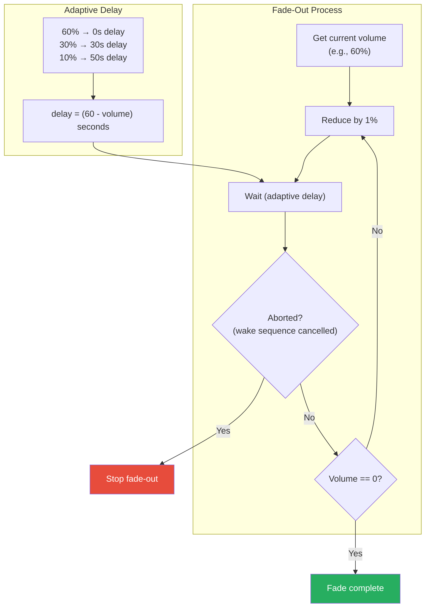
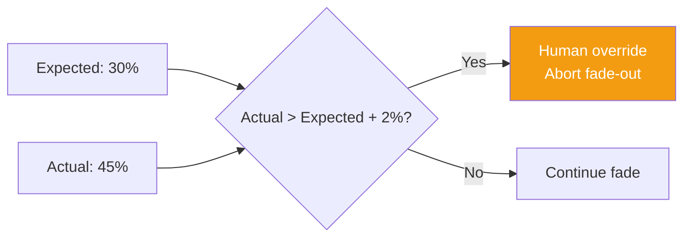
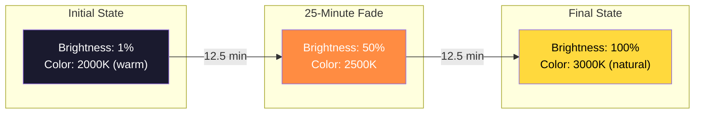
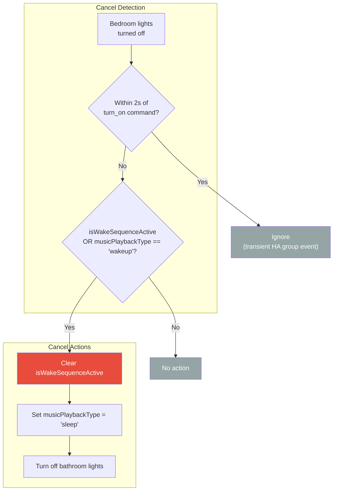

# Sleep Hygiene Flow

This document describes the sleep hygiene automation flow, which manages bedtime reminders, wake-up sequences, and sleep music transitions.

## Overview

The sleep hygiene plugin provides:
1. Scheduled reminders for screen stop and bedtime
2. Coordinated wake-up sequence with Eight Sleep integration
3. Gradual sleep music fade-out
4. Slow bedroom light fade-in for gentle waking

## Daily Schedule Triggers

### Schedule Time Sources

| Trigger | Time Source | Purpose |
|---------|-------------|---------|
| `stop_screens` | `schedule_config.yaml` | Reminder to turn off screens |
| `go_to_bed` | `schedule_config.yaml` | Bedtime reminder + sleep music |
| `begin_backup_wake` | `schedule_config.yaml` | Backup wake if Eight Sleep unavailable |

## Wake-Up Sequence

The primary wake trigger comes from Eight Sleep Pod alarm sensors. A backup time-based trigger activates only when Eight Sleep is unavailable.

### Wake Sequence Timeline

```mermaid
gantt
    title Wake-Up Sequence (30 minutes total)
    dateFormat HH:mm
    axisFormat %H:%M

    section Audio
    Sleep music fade-out    :fadeout, 07:00, 5m
    Silence                 :silence, after fadeout, 25m
    Wake music starts       :wakemusic, 07:30, 1m

    section Lights
    Waiting                 :wait, 07:00, 5m
    Light fade-in (1%→100%) :fadein, 07:05, 25m
```

### Eight Sleep Integration

### Backup Wake Trigger

Eight Sleep availability is checked by querying the sleep stage sensors. If both Nick's and Caroline's sensors are "unavailable", the backup wake trigger activates.

## Sleep Music Fade-Out

### Human Override Detection

During fade-out, if someone manually increases the volume (actual > expected + 2%), the fade-out aborts:

## Bedroom Light Fade-In

## Wake Sequence Cancellation

If bedroom lights are turned off during the wake sequence:

> **Note:** Home Assistant group entities (e.g., `light.primary_suite`) emit transient "off" events (~200-500ms) after a `turn_on` command while constituent lights are still responding. A 2-second grace period after each turn-on command filters these out, preventing false wake cancellation.

## State Variables

### Inputs

| Variable | Type | Source | Description |
|----------|------|--------|-------------|
| `isAnyoneHome` | bool | State Tracking | Someone is home |
| `isMasterAsleep` | bool | State Tracking | Master bedroom occupied/asleep |
| `musicPlaybackType` | string | Music Plugin | Current music mode |
| `isEveryoneAsleep` | bool | State Tracking | All tracked people asleep |

### Outputs

| Variable | Type | Description |
|----------|------|-------------|
| `isFadeOutInProgress` | bool | Sleep music is fading out |
| `isWakeSequenceActive` | bool | Wake sequence lights are protected |
| `musicPlaybackType` | string | Set to "sleep" at bedtime, "wakeup" after lights up |

## Related Documentation

- [DAY_PHASE_MODES.md](./DAY_PHASE_MODES.md) - Day phase and schedule configuration
- [MUSIC_PLAYBACK.md](./MUSIC_PLAYBACK.md) - Music mode transitions
- [LIGHTING_CONTROL.md](./LIGHTING_CONTROL.md) - Wake sequence light protection
- [STATE_TRACKING.md](./STATE_TRACKING.md) - Sleep detection logic
