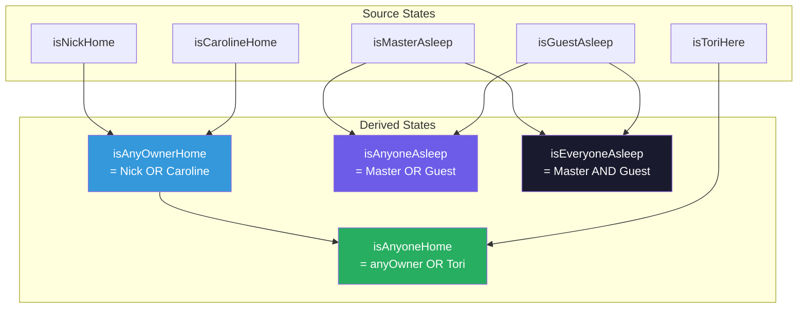
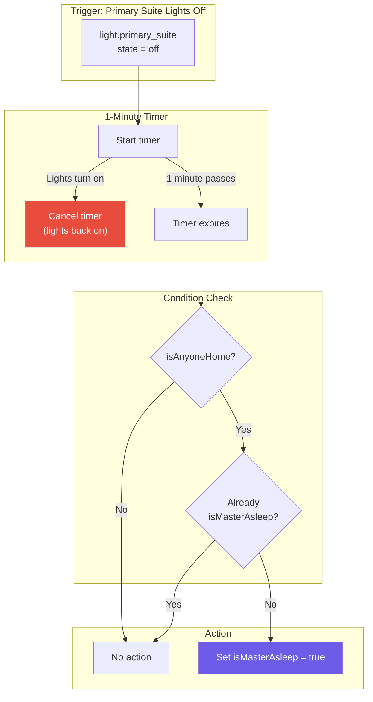
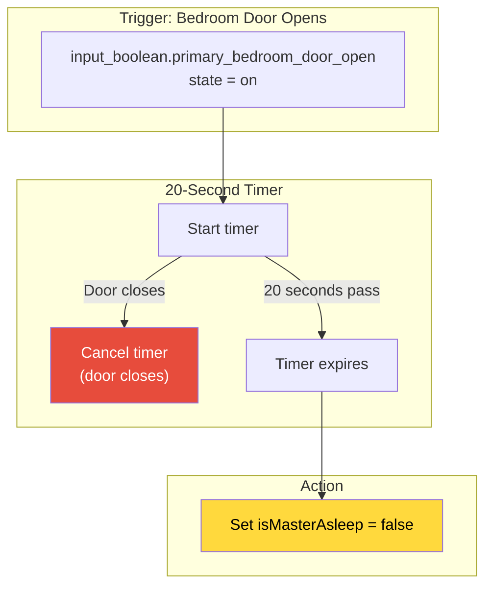
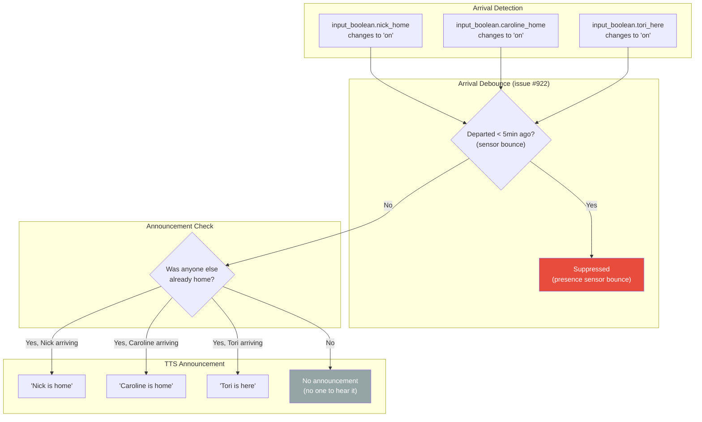
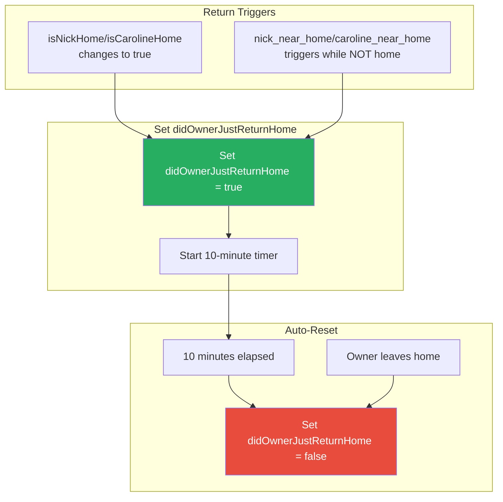
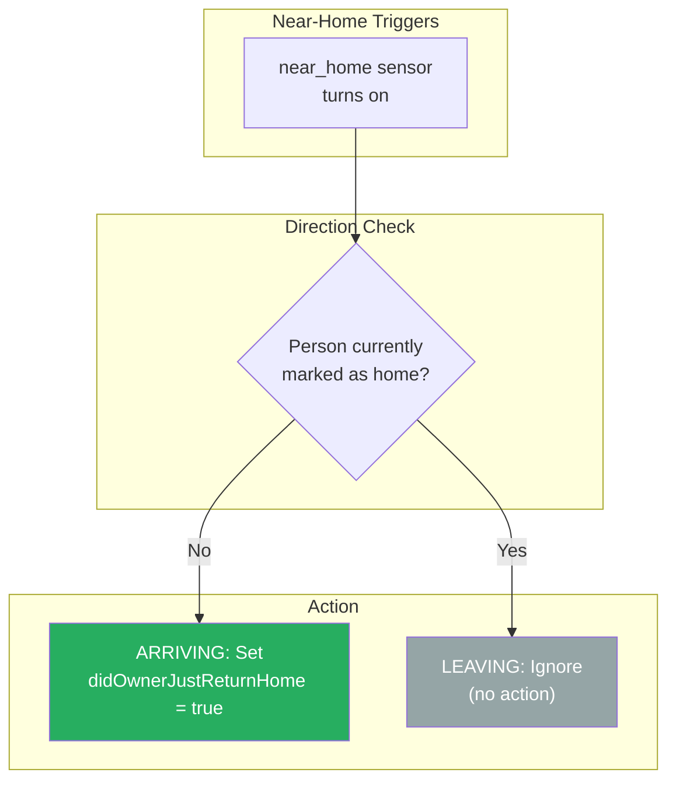

# State Tracking Flow

This document describes the state tracking automation flow, which computes derived presence and sleep states from individual sensor inputs.

## Overview

The state tracking plugin provides:
1. Derived presence states (isAnyoneHome, isAnyOwnerHome)
2. Derived sleep states (isAnyoneAsleep, isEveryoneAsleep)
3. Automatic sleep/wake detection from lights and doors
4. Arrival announcements via TTS
5. Owner return detection for garage automation

## Derived State Computation

### Boolean Logic Table

| Nick | Caroline | Tori | Master Asleep | Guest Asleep | isAnyOwnerHome | isAnyoneHome | isAnyoneAsleep | isEveryoneAsleep |
|------|----------|------|---------------|--------------|----------------|--------------|----------------|------------------|
| Y | N | N | N | N | Y | Y | N | N |
| N | Y | N | N | N | Y | Y | N | N |
| N | N | Y | N | N | N | Y | N | N |
| N | N | N | Y | N | N | N | Y | N |
| Y | Y | N | Y | Y | Y | Y | Y | Y |

## Automatic Sleep Detection

### Master Asleep Detection

### Master Awake Detection

## Arrival Announcements

When someone arrives home and others are present, a TTS announcement plays:

### Speaker Selection by Person

| Person | TTS Speakers |
|--------|--------------|
| Nick | Kitchen, Dining Room, Soundbar, Kids Bathroom |
| Caroline | Kitchen, Dining Room, Kids Bathroom, Soundbar, Office |
| Tori | Kitchen, Dining Room, Kids Bathroom, Soundbar, Office |

## Owner Return Detection

The `didOwnerJustReturnHome` state tracks recent owner arrivals for garage automation:

### Near-Home Geofence Logic

The near_home trigger activates for both arrivals and departures. We filter to only act on arrivals:

## State Variables

### Source Inputs

| Variable | Source Entity | Description |
|----------|---------------|-------------|
| `isNickHome` | `input_boolean.nick_home` | Nick's presence |
| `isCarolineHome` | `input_boolean.caroline_home` | Caroline's presence |
| `isToriHere` | `input_boolean.tori_here` | Tori's presence |
| `isMasterAsleep` | (computed) | Primary suite occupant asleep |
| `isGuestAsleep` | (computed) | Guest room occupant asleep |

### Derived Outputs

| Variable | Formula | Description |
|----------|---------|-------------|
| `isAnyOwnerHome` | Nick OR Caroline | Any owner present |
| `isAnyoneHome` | anyOwner OR Tori | Anyone present |
| `isAnyoneAsleep` | Master OR Guest | Someone asleep |
| `isEveryoneAsleep` | Master AND Guest | Everyone asleep |
| `didOwnerJustReturnHome` | (tracked) | Owner arrived recently |

### Detection Inputs

| Entity | Timer | Action |
|--------|-------|--------|
| `light.primary_suite` | 1 minute off | Mark master asleep |
| `input_boolean.primary_bedroom_door_open` | 20 seconds open | Mark master awake |
| `input_boolean.nick_near_home` | Immediate | Set didOwnerJustReturnHome |
| `input_boolean.caroline_near_home` | Immediate | Set didOwnerJustReturnHome |

## Related Documentation

- [SECURITY.md](./SECURITY.md) - Uses derived states for lockdown
- [MUSIC_PLAYBACK.md](./MUSIC_PLAYBACK.md) - Uses presence for music control
- [LIGHTING_CONTROL.md](./LIGHTING_CONTROL.md) - Uses sleep state for scenes
- [SLEEP_HYGIENE.md](./SLEEP_HYGIENE.md) - Uses sleep state for wake sequence
