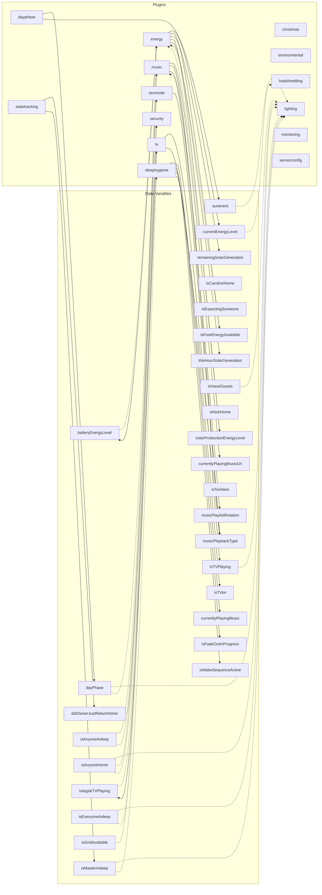

# Plugin State Variable Dependencies

This file is auto-generated by `make generate-diagrams`. Do not edit manually.

## Legend

- **Dashed arrows** (`-.->`) = Plugin subscribes to variable changes
- **Solid arrows** (`-->`) = Plugin writes to variable
- Reads are not shown to reduce visual clutter
