# Visual Architecture Guide

This document provides Mermaid diagrams to visualize the Golang home automation system architecture and logic flows.

## Table of Contents
- [System Architecture](#system-architecture)
- [Plugin System Architecture](#plugin-system-architecture)
- [State Synchronization Flow](#state-synchronization-flow)
- [Shadow State System](#shadow-state-system)
- [API Server Endpoints](#api-server-endpoints)
- [Reset Coordinator Flow](#reset-coordinator-flow)
- [Music Manager Logic Flow](#music-manager-logic-flow)
- [Lighting Control Logic Flow](#lighting-control-logic-flow)
- [Energy State Logic Flow](#energy-state-logic-flow)
- [State Variable Dependency Graph](#state-variable-dependency-graph)

---

## System Architecture

High-level view of the system components and their interactions.

```mermaid
graph TB
    subgraph "Home Automation Go Application"
        Main[cmd/main.go]

        subgraph "Core Layer"
            HAClient[HA WebSocket Client<br/>internal/ha/client.go]
            StateManager[State Manager<br/>internal/state/manager.go]
            Variables[State Variables<br/>internal/state/variables.go]
            Computed[Computed State<br/>internal/state/computed.go]
        end

        subgraph "Observability Layer"
            ShadowTracker[Shadow State Tracker<br/>internal/shadowstate/tracker.go]
            APIServer[HTTP API Server<br/>internal/api/server.go]
        end

        subgraph "Plugin Layer"
            StateTracking[State Tracking<br/>internal/plugins/statetracking/]
            DayPhase[Day Phase<br/>internal/plugins/dayphase/]
            Music[Music Manager<br/>internal/plugins/music/]
            Lighting[Lighting Manager<br/>internal/plugins/lighting/]
            Energy[Energy Manager<br/>internal/plugins/energy/]
            TV[TV Manager<br/>internal/plugins/tv/]
            Sleep[Sleep Hygiene<br/>internal/plugins/sleephygiene/]
            Security[Security Manager<br/>internal/plugins/security/]
            SexMode[Sex Mode<br/>internal/plugins/sexmode/]
            LoadShed[Load Shedding<br/>internal/plugins/loadshedding/]
            Christmas[Christmas<br/>internal/plugins/christmas/]
            Environmental[Environmental<br/>internal/plugins/environmental/]
            SensorHealth[Sensor Health<br/>internal/plugins/sensorhealth/]
            Infrastructure[Infrastructure<br/>internal/plugins/infrastructure/]
            WaterFlow[Water Flow<br/>internal/plugins/waterflow/]
            EVCharger[EV Charger Safety<br/>internal/plugins/evcharger/]
            ResetCoord[Reset Coordinator<br/>internal/plugins/reset/]
            SensorConfig[Sensor Config<br/>internal/plugins/sensorconfig/]
        end

        subgraph "Public Interfaces"
            PkgPlugin[pkg/plugin/interfaces.go]
            PkgHA[pkg/ha/interfaces.go]
            PkgState[pkg/state/interfaces.go]
        end

        subgraph "Configuration"
            ConfigLoader[Config Loader<br/>internal/config/loader.go]
            DayPhaseCalc[Day Phase Calculator<br/>internal/dayphase/calculator.go]
            Clock[Clock Interface<br/>internal/clock/clock.go]
        end
    end

    subgraph "External Systems"
        HA[Home Assistant<br/>WebSocket API]
        Sonos[Sonos Speakers]
        Hue[Phillips Hue]
        TV_Ext[Apple TV / LG TV]
        Ntfy[ntfy.sh<br/>Push Notifications]
        SoCoCLI[SoCo-CLI<br/>HTTP API]
    end

    Main --> HAClient
    Main --> StateManager
    Main --> ShadowTracker
    Main --> APIServer
    Main --> ConfigLoader

    HAClient <-->|WebSocket<br/>Auth, Commands,<br/>State Changes| HA

    StateManager -->|Read/Write<br/>State Variables| HAClient
    StateManager -.->|Subscribe to<br/>State Changes| Variables
    StateManager --> Computed

    APIServer -->|Query State| StateManager
    APIServer -->|Query Shadow| ShadowTracker

    %% Plugin connections
    StateTracking -->|Get/Set State| StateManager
    StateTracking -.->|Register Shadow| ShadowTracker

    DayPhase -->|Get/Set State| StateManager
    DayPhase -->|Use| DayPhaseCalc
    DayPhase -.->|Register Shadow| ShadowTracker

    Music -->|Get/Set State| StateManager
    Music -->|Call Services| HAClient
    Music -->|Speaker Commands<br/>& Tidal Playback| SoCoCLI
    Music -.->|Register Shadow| ShadowTracker

    Lighting -->|Get/Set State| StateManager
    Lighting -->|Call Services| HAClient
    Lighting -.->|Register Shadow| ShadowTracker

    Energy -->|Get/Set State| StateManager
    Energy -.->|Register Shadow| ShadowTracker

    TV -->|Get/Set State| StateManager
    TV -->|Call Services| HAClient
    TV -.->|Register Shadow| ShadowTracker

    Sleep -->|Get/Set State| StateManager
    Sleep -->|Call Services| HAClient
    Sleep -.->|Register Shadow| ShadowTracker

    Security -->|Get/Set State| StateManager
    Security -->|Call Services| HAClient
    Security -.->|Register Shadow| ShadowTracker

    SexMode -->|Get/Set State| StateManager
    SexMode -->|Call Services| HAClient
    SexMode -.->|Register Shadow| ShadowTracker

    LoadShed -->|Get/Set State| StateManager
    LoadShed -->|Call Services| HAClient
    LoadShed -.->|Register Shadow| ShadowTracker

    Christmas -->|Get/Set State| StateManager
    Christmas -->|Call Services| HAClient
    Christmas -.->|Register Shadow| ShadowTracker

    Environmental -->|Entity Subscriptions| HAClient
    Environmental -->|Notifications| Ntfy
    Environmental -.->|Register Shadow| ShadowTracker

    SensorHealth -->|Entity Subscriptions| HAClient
    SensorHealth -->|Notifications| Ntfy
    SensorHealth -.->|Register Shadow| ShadowTracker

    Infrastructure -->|Entity Subscriptions| HAClient
    Infrastructure -->|Notifications| Ntfy
    Infrastructure -->|TTS Announcements| HAClient
    Infrastructure -.->|Register Shadow| ShadowTracker

    WaterFlow -->|Entity Subscriptions| HAClient
    WaterFlow -->|Notifications| Ntfy
    WaterFlow -->|TTS Announcements| HAClient
    WaterFlow -.->|Register Shadow| ShadowTracker

    EVCharger -->|Entity Subscriptions| HAClient
    EVCharger -->|Call Services| HAClient
    EVCharger -->|Notifications| Ntfy
    EVCharger -->|TTS Announcements| HAClient
    EVCharger -.->|Register Shadow| ShadowTracker

    ResetCoord -->|Subscribe to reset| StateManager
    ResetCoord -.->|Reset All| StateTracking
    ResetCoord -.->|Reset All| Music
    ResetCoord -.->|Reset All| Lighting

    SensorConfig -->|Configure Thresholds| HAClient
    SensorConfig -.->|Register Shadow| ShadowTracker

    HA -->|Control| Sonos
    HA -->|Control| Hue
    HA -->|Monitor| TV_Ext

    style Main fill:#e1f5ff
    style HAClient fill:#fff3e0
    style StateManager fill:#fff3e0
    style ShadowTracker fill:#e8f5e9
    style APIServer fill:#e8f5e9
    style Music fill:#f3e5f5
    style Lighting fill:#f3e5f5
    style Energy fill:#f3e5f5
    style TV fill:#f3e5f5
    style Sleep fill:#f3e5f5
    style Security fill:#f3e5f5
    style SexMode fill:#f3e5f5
    style LoadShed fill:#f3e5f5
    style Christmas fill:#f3e5f5
    style Environmental fill:#f3e5f5
    style SensorHealth fill:#f3e5f5
    style StateTracking fill:#f3e5f5
    style DayPhase fill:#f3e5f5
    style WaterFlow fill:#f3e5f5
    style EVCharger fill:#f3e5f5
    style ResetCoord fill:#ffebee
    style SensorConfig fill:#f3e5f5
```

---

## Plugin System Architecture

The plugin system supports priority-based registration, allowing private implementations to override public plugins.

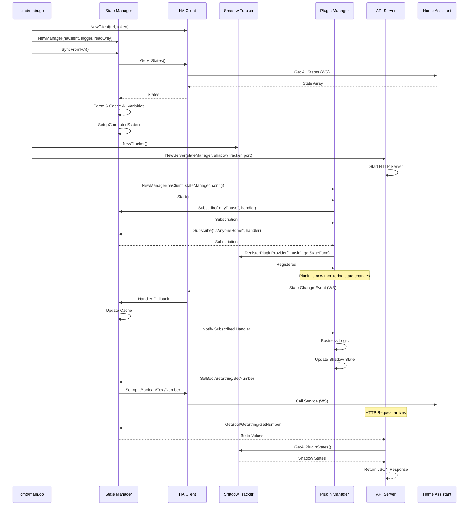

### Plugin Lifecycle

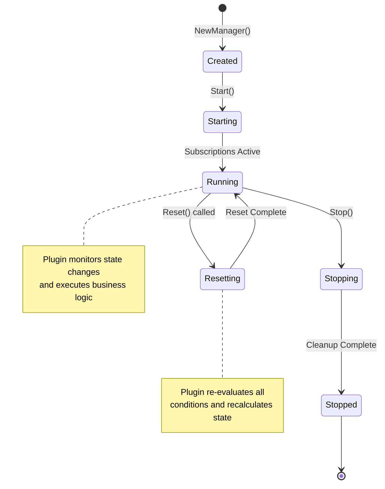

### Plugin Interfaces

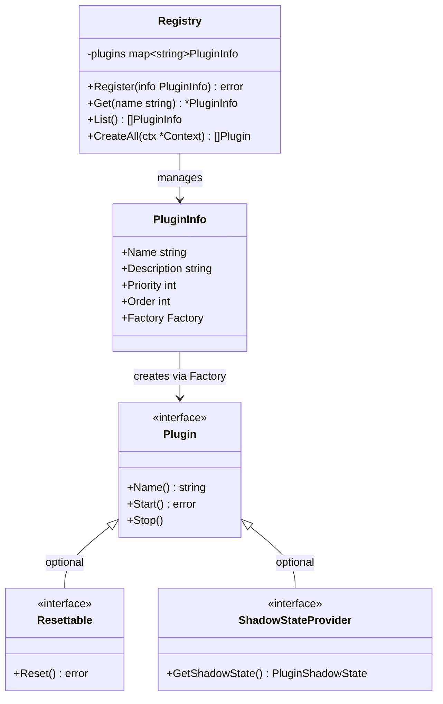

---

## State Synchronization Flow

How state changes propagate through the system.

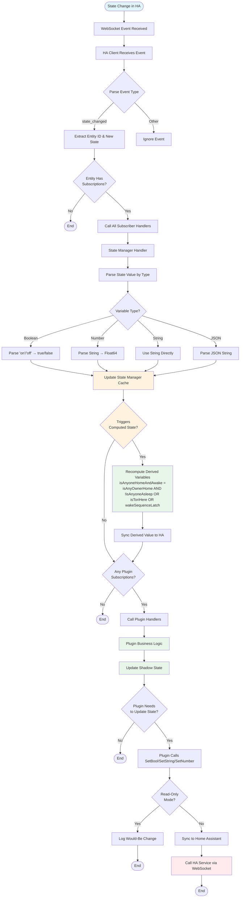

---

## Shadow State System

Shadow state captures the decision-making context for each plugin, enabling debugging and observability.

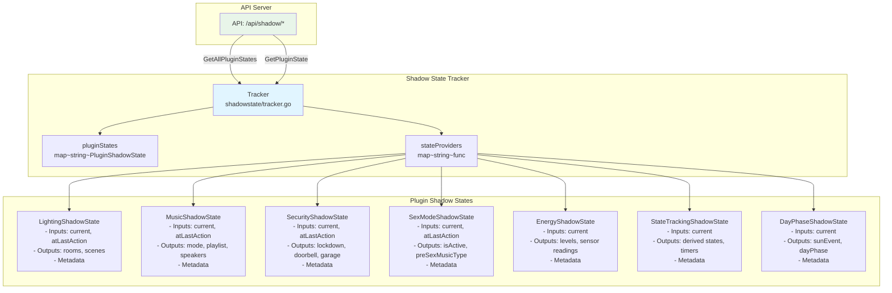

### Shadow State Interface

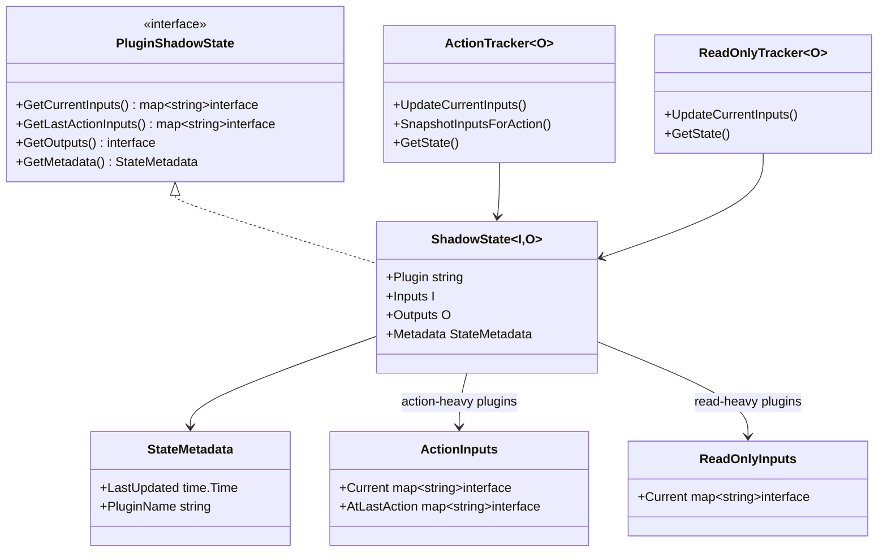

---

## API Server Endpoints

The HTTP API server provides observability into the system state.

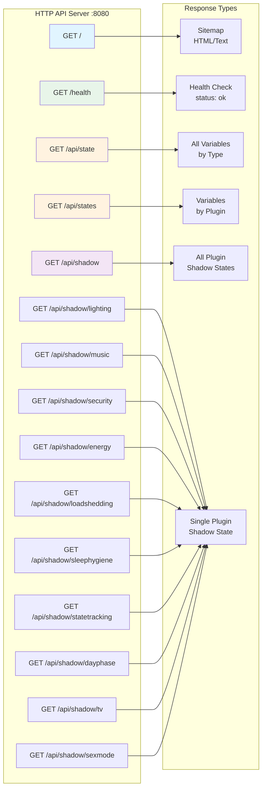

### API Response Structure

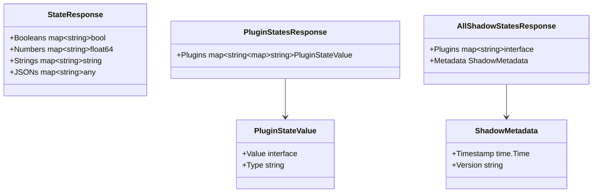

---

## Reset Coordinator Flow

The Reset Coordinator watches for the `reset` boolean and orchestrates system-wide resets.

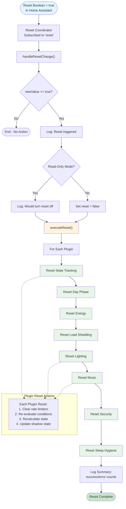

---

## Music Manager Logic Flow

Zone-based music orchestration. All music selection is driven by zone trigger evaluation — there is no separate decision tree. Configs without explicit zones auto-generate them at load time via `ensureZones()` (PR #639).

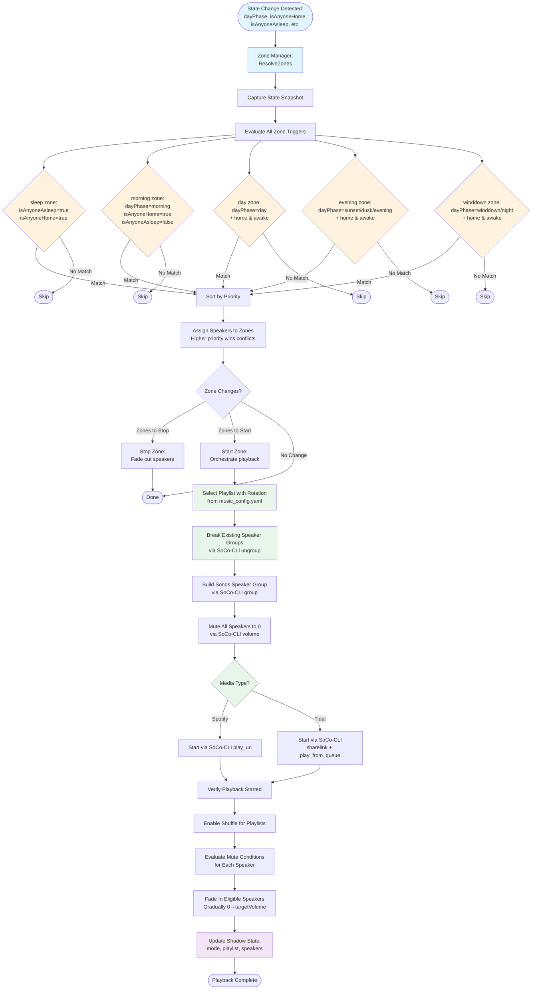

**Reference:** See `homeautomation-go/internal/plugins/music/zone_manager.go` and `config.go` for implementation details.

**Zone Resolution:**
1. State change triggers `ResolveZones` in the zone manager
2. All zone trigger conditions are evaluated against current state
3. Matching zones are sorted by priority (sleep=100 > morning=50 > day/evening=40)
4. Speakers are assigned to highest-priority zone (no speaker shared between zones)
5. Zones that lost all speakers are stopped; new zones are started

**Playback Sequence (per zone):**
1. Select playlist with rotation
2. Break existing speaker groups (SoCo-CLI ungroup)
3. Build new speaker group (SoCo-CLI group)
4. Mute all speakers to 0 (SoCo-CLI volume)
5. Start playback on lead player (Spotify via SoCo-CLI play_uri; Tidal via SoCo-CLI sharelink)
6. Enable shuffle for playlists (SoCo-CLI shuffle)
7. Fade in eligible speakers (SoCo-CLI volume)

> **Note:** All speaker commands route through SoCo-CLI (direct UPnP) when configured. State reads (current volume, playback status) still go through Home Assistant.

---

## Lighting Control Logic Flow

Scene activation based on day phase and conditional logic (matches Node-RED Lighting Control flow).

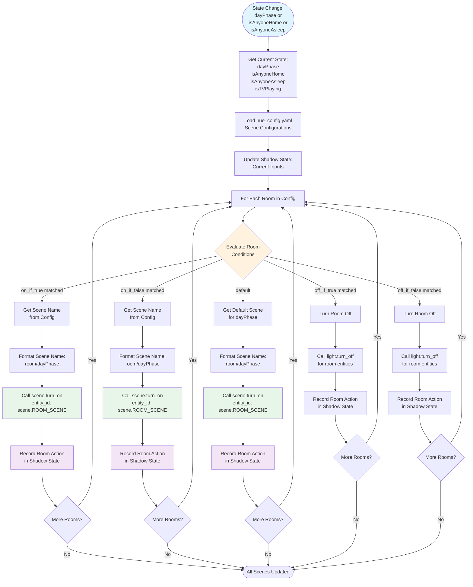

**Reference:** See `homeautomation-go/internal/plugins/lighting/manager.go` for implementation details.

**Condition Evaluation Logic:**
- `on_if_true`: Activate scene if ALL specified state variables are true
- `on_if_false`: Activate scene if ALL specified state variables are false
- `off_if_true`: Turn off room if ALL specified state variables are true
- `off_if_false`: Turn off room if ALL specified state variables are false
- Conditions are evaluated in order of precedence: off conditions → on conditions → default

---

## Energy State Logic Flow

Battery level calculation and energy state management (matches Node-RED Energy State flow).

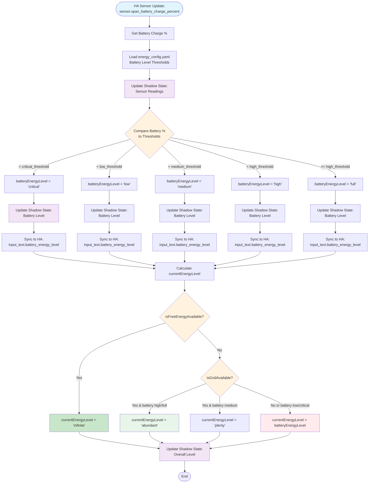

**Reference:** See `homeautomation-go/internal/plugins/energy/manager.go` for implementation details.

---

## State Variable Dependency Graph

Shows which plugins read/write which state variables (41 total: 28 booleans, 3 numbers, 8 strings, 2 local-only).

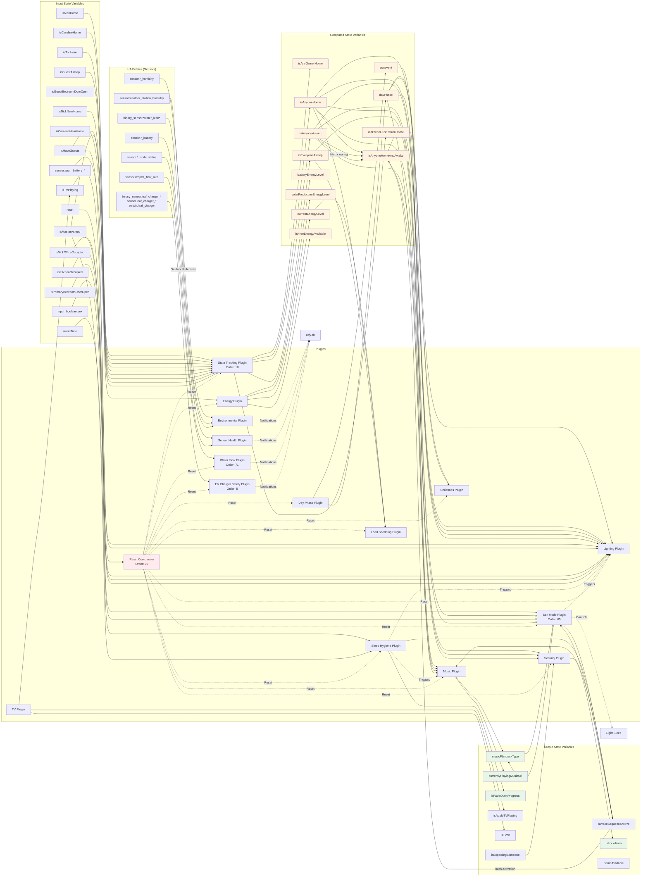

### State Variable Summary

| Category | Count | Examples |
|----------|-------|----------|
| **Boolean (input)** | 19 | isNickHome, isCarolineHome, isToriHere, isMasterAsleep, isHaveGuests, isNickOfficeOccupied, isKitchenOccupied, isPrimaryBedroomDoorOpen, isNickNearHome, isCarolineNearHome, isFrontOfHousePersonPresent |
| **Boolean (computed)** | 6 | isAnyOwnerHome, isAnyoneHome, isAnyoneAsleep, isEveryoneAsleep, isAnyoneHomeAndAwake, isGuestAsleep |
| **Boolean (output)** | 3 | isFadeOutInProgress, isWakeSequenceActive, isLockdown |
| **Number** | 3 | alarmTime, remainingSolarGeneration, thisHourSolarGeneration |
| **String (computed)** | 5 | dayPhase, sunevent, batteryEnergyLevel, currentEnergyLevel, solarProductionEnergyLevel |
| **String (output)** | 3 | musicPlaybackType, currentlyPlayingMusicUri, musicPlaylistRotation |
| **Local-only** | 2 | didOwnerJustReturnHome (bool), currentlyPlayingMusic (JSON) |

---

## How to Use These Diagrams

### Viewing in GitHub
All Mermaid diagrams render automatically in GitHub's markdown viewer.

### Viewing in VS Code
Install the "Markdown Preview Mermaid Support" extension for inline rendering.

### Updating Diagrams
When code changes significantly:
1. Update the relevant diagram(s) in this file
2. Ensure the diagram matches actual implementation
3. Reference file paths and line numbers when helpful
4. Update the "Last Updated" date in git commits

### Creating New Diagrams
Follow these conventions:
- Use consistent colors:
  - Light blue (`#e1f5ff`) for entry points
  - Light orange (`#fff3e0`) for decision/branching logic
  - Light green (`#e8f5e9`) for actions/outputs
  - Light purple (`#f3e5f5`) for shadow state / observability
  - Light red (`#ffebee`) for error/critical paths
- Include file references for traceability
- Keep diagrams focused on one concept/flow
- Link to implementation code with file paths

---

**Last Updated:** 2026-01-02
**Maintained By:** Development Team
**Related Documentation:**
- [ARCHITECTURE.md](../architecture/ARCHITECTURE.md) - Architecture and design decisions
- [migration_mapping.md](../reference/migration_mapping.md) - State variable mapping
