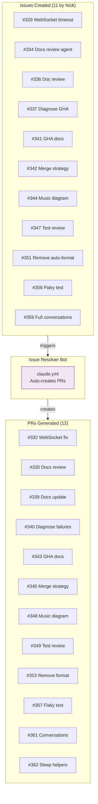
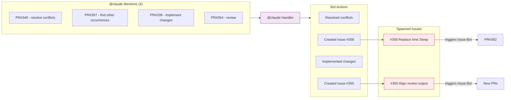
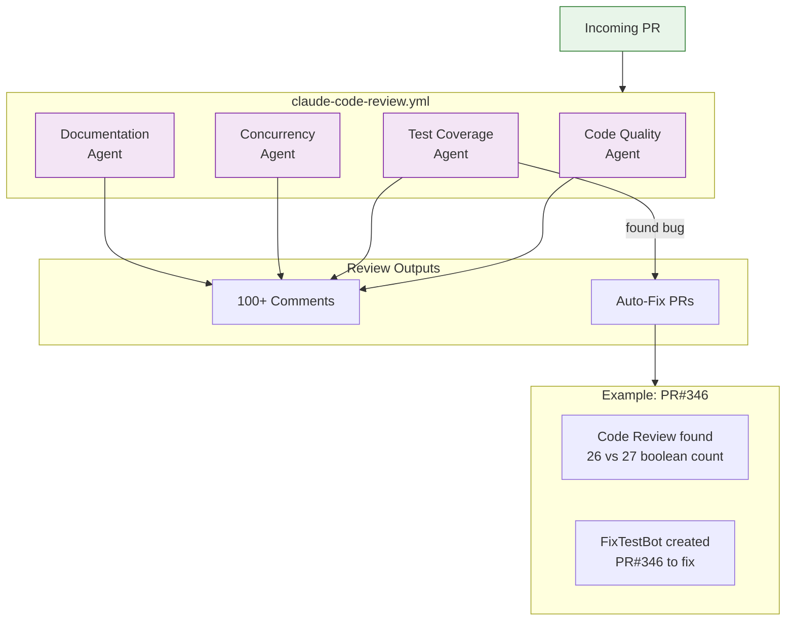
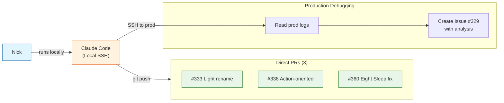
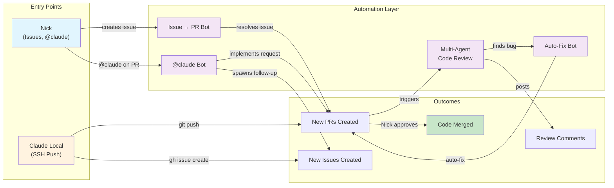

# Automated Code Change Interactions - 2026-01-02

This document visualizes the web of automated interactions in this repository on January 2, 2026, demonstrating how deeply integrated Claude-powered automation has become in the development workflow.

## Summary Statistics

| Metric | Count |
|--------|-------|
| Issues created | 21 |
| PRs created | 30+ |
| PRs merged | 30 |
| @claude mentions | 12 |
| Workflow runs | 100+ |
| Human commits | ~0 (all Claude-authored) |

## System Overview

```mermaid
flowchart LR
    subgraph Actors["Actors"]
        Nick["Nick (Human)"]
        LocalClaude["Claude Code<br/>Local SSH"]
    end

    subgraph Automation["GitHub Actions Bots"]
        IssueBot["Issue Resolver<br/>claude.yml"]
        MentionBot["@claude Handler<br/>claude.yml"]
        ReviewBot["Code Review<br/>4 agents"]
        DiagnoseBot["Failure Diagnosis"]
    end

    subgraph Artifacts["Work Items"]
        Issues[("21 Issues")]
        PRs[("30+ PRs")]
        Main[("main branch<br/>30 merges")]
    end

    Nick -->|creates| Issues
    Nick -->|@claude| MentionBot
    Nick -->|runs| LocalClaude
    Nick -->|approves| Main

    LocalClaude -->|git push| PRs
    LocalClaude -->|gh issue| Issues

    Issues -->|triggers| IssueBot
    IssueBot -->|creates| PRs

    MentionBot -->|creates| PRs
    MentionBot -->|spawns| Issues

    PRs -->|triggers| ReviewBot
    ReviewBot -->|auto-fix| PRs

    PRs --> Main

    style Nick fill:#e1f5fe,stroke:#01579b
    style LocalClaude fill:#fff3e0,stroke:#e65100
    style IssueBot fill:#f3e5f5,stroke:#7b1fa2
    style MentionBot fill:#f3e5f5,stroke:#7b1fa2
    style ReviewBot fill:#f3e5f5,stroke:#7b1fa2
    style DiagnoseBot fill:#f3e5f5,stroke:#7b1fa2
    style Issues fill:#ffebee,stroke:#c62828
    style PRs fill:#e8f5e9,stroke:#2e7d32
    style Main fill:#fffde7,stroke:#f57f17
```

## Issue-to-PR Pipeline

This diagram shows how issues flow through the automation pipeline to become merged PRs.



## @claude Mention Flow

When Nick mentions @claude on PRs, it can create new work items that feed back into the system.



## Code Review Multi-Agent System

Every PR triggers a multi-agent review with specialized reviewers.



## Local Claude (SSH) Contributions

Claude running locally via SSH can directly push code and create issues.



## Simplified Flow Diagram



## Key Automation Chains from Today

### Chain 1: Issue → Auto-PR → Review → Merge
```
Nick creates #356 (flaky test)
    ↓
claude.yml triggers, creates PR #357
    ↓
PR Tests run, pass
    ↓
Claude Code Review runs (4 agents comment)
    ↓
Nick merges PR #357
```

### Chain 2: @claude Spawns New Issue → New PR
```
Nick comments "@claude" on PR #357 asking for other occurrences
    ↓
Claude finds 216 time.Sleep calls across 12 files
    ↓
Claude creates Issue #358 documenting the problem
    ↓
claude.yml picks up #358, creates PR #362
```

### Chain 3: Code Review Auto-Fix
```
PR #339 created for documentation update
    ↓
Code Review agent notices incorrect comment (26 vs 27 booleans)
    ↓
FixTestBot creates PR #346 to fix the comment
    ↓
PR #346 merged independently
```

### Chain 4: Local Claude → SSH → Issue/PR
```
Nick notices production bug in logs (via SSH)
    ↓
Asks local Claude to diagnose
    ↓
Claude SSHs into prod, reads logs, identifies root cause
    ↓
Claude creates Issue #329 with detailed analysis
    ↓
OR: Claude creates fix PR directly via git push
```

## Actors Summary

| Actor | Role | Today's Activity |
|-------|------|------------------|
| **Nick (Human)** | Creates issues, @claude mentions, approves/merges | 21 issues, 12 @claude, 30 merges |
| **claude.yml (Issue Bot)** | Auto-creates PRs from issues | 12+ PRs created |
| **claude.yml (@claude Bot)** | Responds to @claude mentions | 12 interactions, 2 new issues |
| **claude-code-review.yml** | 4 review agents per PR | 100+ review comments |
| **Fix Test Failures Agent** | Creates PRs for bugs found in review | 1 PR (#346) |
| **Claude Local (SSH)** | Direct code changes, issue creation | 3+ PRs, 1+ issues |

## Observations

1. **Zero human-written code**: All commits today were authored by Claude (either via GHA or local)

2. **Self-propagating work**: @claude mentions on PRs created 2 new issues (#350, #358), which then spawned their own PRs

3. **Multi-agent review**: Every PR gets reviewed by 4 specialized agents (code quality, testing, concurrency, documentation)

4. **Automated bug discovery**: Code review found a documentation bug and auto-created a fix PR

5. **Closed-loop debugging**: Local Claude can SSH into production, diagnose issues from logs, and create issues with full context

---

*Generated by Claude Code analyzing GitHub activity on 2026-01-02*
